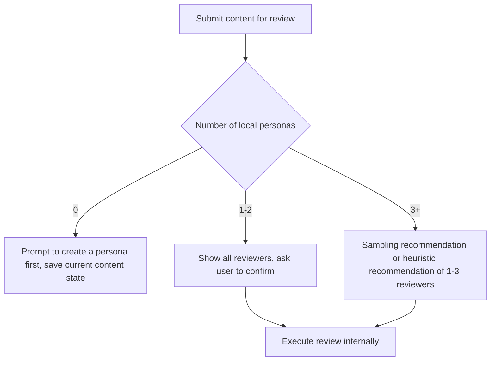
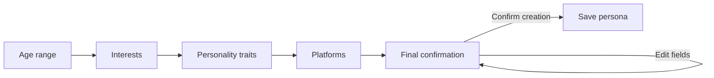
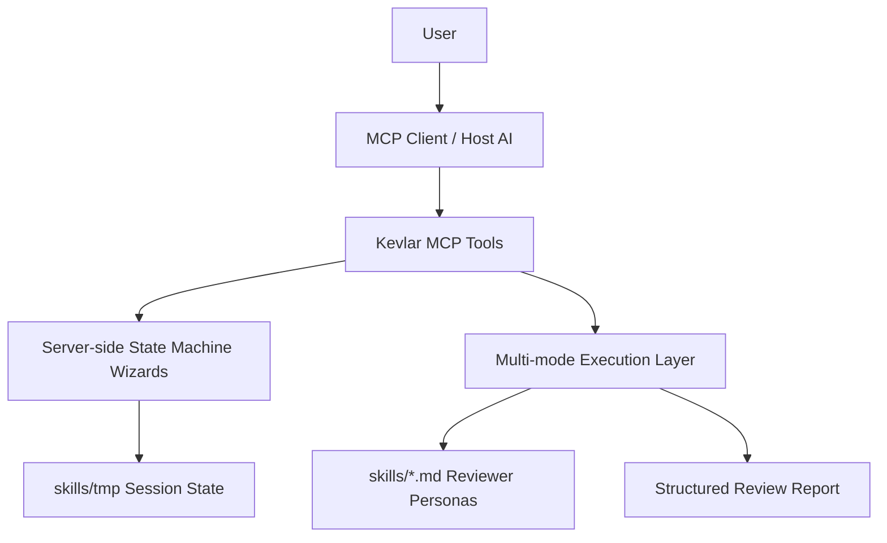

# Kevlar — 댓글 시뮬레이터


🌐 [English](README.md) · [中文](README.zh.md) · [日本語](README.ja.md) · [한국어](README.ko.md)

---

> **다양한 독자의 실제 반응 — 일반 사용자, 까다로운 네티즌, 기술 사용자, 미디어 시각 — 을 시뮬레이션하여 게시 전에 표현 문제, 오해 가능성, 커뮤니케이션 리스크를 발견할 수 있도록 도와줍니다.**

---

게시하려는 모든 콘텐츠 — **기사, 트윗, 영상 스크립트, 제품 소개, 보도자료, 공지, Reddit 게시물, V2EX 게시물, Hacker News 헤드라인** — 을 Kevlar에 바로 던져보세요. 단순히 "괜찮네요"라고 말하지 않습니다. 대신 실제 인터넷처럼 **질문하고, 오해하고, 비꼬고, 잔소리하고, 이해도를 테스트**합니다.

작가라면 누구나 **"지식의 저주"** 를 겪습니다:
스스로는 명확하게 썼다고 생각하지만, 다른 사람들은 이해하지 못합니다.
핵심 포인트가 두드러진다고 생각하지만, 독자들은 무슨 말을 하려는지 알 수 없습니다.

그리고 대부분의 플랫폼은 진정한 **A/B 테스트**를 제공하지 않습니다. 콘텐츠가 공개되고 나면, **첫 번째 유기 트래픽**이 지나간 후에는 수정하기엔 보통 너무 늦습니다.

**Kevlar는 게시를 누르기 전에 이런 문제들을 표면으로 끌어올려 줍니다.**

## Kevlar가 필요한 사람

**인디 개발자** / **콘텐츠 크리에이터** / **프로덕트 팀** / **PR 팀** / X, Reddit, V2EX, Hacker News 헤비 유저 / 콘텐츠 품질과 도달 범위를 개선하려는 모든 분

---

## 핵심 기능

### 1. 자유자재로 커스터마이징 가능한 리뷰어 (페르소나 커스터마이징)

단일 AI 시각에서 벗어나 다양한 페르소나를 설정할 수 있습니다:

- **핵심 속성**: 나이, 관심사, 성격, 입장.
- **인지 & 관계**: 블라인드 스팟(예: 도메인 특화 편향)과 저자와의 사회적 관계(예: 엄격한 멘토, 급진적 반대자)를 정의합니다.
- **문화 적응**: 시스템이 입력 콘텐츠의 언어를 자동 감지하고, 이에 맞는 지역화된 문화적 맥락을 추론합니다.

### 2. 완전 자동화된 피드백 파이프라인

- **스마트 디스패치**: 작업을 붙여넣으면 AI 디스패처가 콘텐츠 특성을 자동 분석합니다.
- **정밀 매칭**: 가장 관련성 높은 리뷰어를 동적으로 필터링하고 스케줄링합니다.
- **다차원 충돌**: 다양한 입장과 전문적 관점에서 차별화된 코멘트와 피드백을 유발합니다.

---

## 빠른 시작

**Node.js 20+** 가 필요합니다.

```bash
npm install           # 의존성 설치
npm run build         # TypeScript 컴파일
npm run setup         # 제로-설정 셋업 (MCP 클라이언트 자동 감지 및 설정 작성)
npm run kevlar-4u    # 인터랙티브 설치 CLI (수동으로 클라이언트 선택)
```

설치가 완료되면 AI 클라이언트를 재시작하여 Kevlar를 사용하세요. 다음 클라이언트의 자동 구성을 지원합니다:

**Claude Desktop** / **Cursor** / **Windsurf** / **OpenCode** / **Codex** / **Antigravity** / **CodeBuddy CN** / **WorkBuddy**

로컬 개발:

```bash
npm run dev
```

프로덕션 시작:

```bash
npm start
```

---

## 사용 가이드

### 핵심 워크플로우

Kevlar의 모든 핵심 작업은 Wizard 도구를 통해 처리됩니다 — AI에게 자연어로 원하는 것을 말하기만 하면 Kevlar가 나머지를 처리합니다.

### 권장 도구 흐름

| Wizard 도구 | 목적 | 주요 동작 |
| --- | --- | --- |
| `review_content_wizard` | 콘텐츠 리뷰 | 콘텐츠 제출 → 리뷰어 선택 → 확인 → 다차원 피드백 |
| `create_persona_wizard` | 페르소나 생성 | 역할 설명 → AI가 필드 추출 → 최종 확인 → 페르소나 저장 |
| `delete_persona_wizard` | 페르소나 삭제 | 대상 선택 → `confirm delete {페르소나 이름}` 응답 → 완료 |
| `configure_wizard` | 설정 변경 | 변경사항 미리보기 → `confirm config changes` 응답 → 저장 |

저수준 직접 도구 (자동화 스크립트에 적합):

| 도구 | 목적 |
| --- | --- |
| `create_persona` | 페르소나 직접 생성 또는 초안에서 생성 |
| `delete_persona` | 페르소나 직접 삭제 (`confirm: true` 필요) |
| `configure` | 설정 직접 저장 |
| `get_execution_modes` | 현재 모드 및 가용성 확인 |
| `list_personas` | 로컬 페르소나 목록 조회 |
| `kevlar_help` | 도움말 보기 |

### 콘텐츠 리뷰 흐름

`review_content_wizard`는 "콘텐츠 저장, 리뷰어 선택, 실행 확인"을 하나의 안정적인 흐름으로 연결합니다.



### 리뷰어 페르소나 생성

`create_persona_wizard`는 페르소나 생성을 단계별로 안내합니다.



생성 후 Kevlar는 문화적 배경, 저자와의 관계, 입장, 블라인드 스팟을 자동으로 추론하여 `skills/*.md`에 저장합니다.

---

## 실행 모드

Kevlar는 세 가지 실행 모드를 지원합니다. 기본값인 `auto`는 환경에 따라 최적의 모드를 선택합니다.

| 모드 | 식별자 | 설명 | 적합한 환경 |
| --- | --- | --- | --- |
| MCP Sampling | `mcp_sampling` | 각 리뷰어가 독립적인 샘플링 요청을 받음, 최대 격리 | Sampling을 지원하는 클라이언트, 진정한 다각도 리뷰를 원하는 경우 |
| Direct API | `direct_api` | 외부 모델 API를 직접 호출 | Sampling 미지원 클라이언트 또는 스크립트 자동화 |
| Orchestration (호스트 보조 폴백) | `orchestration` | 호스트 AI가 완료를 지원, 낮은 격리의 폴백 | Sampling도 API Key도 사용 불가능한 최후의 수단 |

`auto` 모드 해결 순서:

1. `skills/kevlar-config.json`에 지정된 모드 사용 (설정된 경우)
2. 그렇지 않으면 `KEVLAR_MODE` 환경 변수 읽기
3. 그렇지 않으면 가용성에 따라 자동 선택: `mcp_sampling` → `direct_api` → `orchestration`

---

## 설정

### 런타임 설정

`configure_wizard`를 사용하여 런타임 환경설정을 변경하세요. 설정은 `skills/kevlar-config.json`에 저장됩니다 (로컬 전용, 저장소에 커밋되지 않음).

```json
{
  "mode": "auto",
  "multiAgent": {
    "maxConcurrency": 3
  }
}
```

### 환경 변수

| 변수 | 기본값 | 설명 |
| --- | --- | --- |
| `KEVLAR_MODE` | `auto` | `auto`, `orchestration`, `mcp_sampling`, `direct_api` |
| `KEVLAR_MAX_CONCURRENT` | `3` | 최대 동시 리뷰어 수 |
| `KEVLAR_TOKEN_BUDGET_PER_TASK` | `50000` | 리뷰 작업당 토큰 예산 |
| `KEVLAR_MIN_DELAY_MS` | `1000` | 요청 간 최소 지연 시간 |
| `KEVLAR_SKILLS_DIR` | `<repo>/skills` | 커스텀 페르소나 및 설정 디렉토리 |
| `KEVLAR_API_KEY` | — | 선호하는 Direct API 키 |
| `ANTHROPIC_API_KEY` | — | Anthropic API 키 |
| `OPENAI_API_KEY` | — | OpenAI API 키 |
| `LOG_LEVEL` | `info` | `debug`, `info`, `warn`, `error` |

> API 키는 환경 변수로만 읽습니다 — 설정 파일에 기록되지 않습니다.

### 수동 MCP 클라이언트 설정

Claude Desktop 예시:

```json
{
  "mcpServers": {
    "kevlar": {
      "command": "node",
      "args": ["/ABSOLUTE/PATH/TO/kevlar/dist/index.js"],
      "env": {
        "KEVLAR_MODE": "auto",
        "KEVLAR_MAX_CONCURRENT": "3"
      }
    }
  }
}
```

커스텀 페르소나 디렉토리:

```json
{
  "env": {
    "KEVLAR_SKILLS_DIR": "/ABSOLUTE/PATH/TO/skills"
  }
}
```

---

## 보안 경계

- `sessionId`는 `[a-z0-9-]` 만 허용합니다.
- 페르소나 쓰기 및 삭제 작업은 경로 검증을 통해 `skills/` 디렉토리로 제한됩니다.
- 런타임 초안 및 Wizard 상태는 `skills/tmp/`에 저장되며, 만료된 초안은 시작 시 정리됩니다.
- 페르소나 삭제는 대상을 선택한 후 전체 확인 문구를 응답해야 합니다.
- 설정 변경은 확인 전에 미리보기가 필요합니다.
- API 키는 도구 파라미터로 전달되거나 로컬 설정에 기록되지 않습니다.
- `orchestration` 이외의 모드는 여러 외부 모델 작업 간 리소스 경합을 방지하기 위해 리뷰 잠금을 사용합니다.

---

## 아키텍처 개요

Kevlar는 **서버 측 워크플로우 + 실행 레이어** 아키텍처를 사용합니다.



설계 원칙:

- **상태 머신 기반 워크플로우**: 주요 흐름은 도구 상태 머신이 관리하며, 호스트 AI가 긴 프롬프트를 기억하는 데 의존하지 않습니다.
- **AI는 이해와 표현을 담당**: AI가 자연어 추출, 다듬기, 추천을 처리하고, 결과는 Kevlar가 검증 가능한 상태로 저장됩니다.
- **적응형 실행**: MCP Sampling이 가능하면 이를 필드 추출 및 리뷰어 추천에 사용하고, 그렇지 않으면 휴리스틱 로직 또는 호스트 보조 오케스트레이션으로 폴백합니다.
- **안전한 확인**: 삭제, 초기화, 설정 저장과 같은 고위험 작업은 모두 확인 Wizard를 거칩니다.

### 디렉토리 구조

```text
kevlar/
├── config/
│   └── mcp-config.json                    # MCP 클라이언트 설정 템플릿
├── docs/                                  # 아키텍처 설계, 감사 리포트
├── scripts/                               # 설치 및 설정 스크립트
│   ├── cli.ts                             # 인터랙티브 설치 CLI
│   ├── registry.ts                        # MCP 클라이언트 감지
│   └── setup.ts                           # 제로-설정 셋업 스크립트
├── skills/                                # 리뷰어 페르소나 라이브러리
│   ├── _template.md                       # 페르소나 템플릿
│   └── tmp/                               # 런타임 Wizard 세션 상태
├── src/
│   ├── index.ts                           # stdio 서버 진입점
│   ├── server.ts                          # MCP 서버, DI, 도구 등록
│   ├── __tests__/                         # 테스트 스위트
│   ├── execution/                         # 다중 모드 실행 레이어
│   │   ├── index.ts                       # 실행 진입점, 모드 해결
│   │   ├── base.ts                        # 타입 정의 및 인터페이스
│   │   ├── client.ts                      # 클라이언트 기능 감지
│   │   ├── config.ts                      # 설정 읽기/쓰기
│   │   ├── aggregator.ts                  # 리뷰 리포트 집계
│   │   ├── limiter.ts                     # 동시성 제한 및 재시도
│   │   ├── lock.ts                        # 리뷰 잠금
│   │   ├── parallel.ts                    # 공유 병렬 실행
│   │   └── modes/
│   │       ├── orchestration.ts
│   │       ├── sampling.ts
│   │       └── direct_api.ts
│   ├── tools/                             # MCP 도구
│   │   ├── index.ts                       # 도구 레지스트리
│   │   ├── listPersonasTool.ts
│   │   ├── createPersonaTool.ts           # 페르소나 생성 + 초안 관리
│   │   ├── createPersonaWizardTool.ts
│   │   ├── deletePersonaTool.ts
│   │   ├── deletePersonaWizardTool.ts
│   │   ├── reviewTool.ts
│   │   ├── reviewContentWizardTool.ts
│   │   ├── configureTool.ts
│   │   ├── configureWizardTool.ts
│   │   ├── getModesTool.ts
│   │   └── helpTool.ts
│   ├── prompts/
│   │   └── reviewDispatcherPrompt.ts      # 내부 설계 참조
│   └── utils/
│       ├── errors.ts                      # 에러 코드 및 포맷팅
│       ├── logger.ts                      # 구조화된 로깅
│       ├── parser.ts                      # 페르소나 파일 파싱 및 쓰기
│       ├── sanitize.ts                    # 자격증명 스캐닝, 프롬프트 경계 처리
│       └── ...
└── package.json
```

---

## 리뷰어 페르소나 기여하기

`skills/` 아래에 플랫폼별로 서브디렉토리와 `.md` 파일을 추가하거나 (또는 `skills/` 루트에 직접 배치하세요). 커스텀 페르소나 파일은 기본적으로 `.gitignore`에 의해 제외되며 저장소에 커밋되지 않습니다.

템플릿 `skills/_template.md`를 참조하세요:

```markdown
---
id: your_persona_id
name: Display name
description: One-line description of what this reviewer focuses on
tags:
  - Platform
  - Interest
author: custom
---

Age range:
Interests:
Platforms:
Personality traits:
- Trait → Behavior

Cultural background:
Relationship with author:
Stance:
Blind spots:
```

커스텀 페르소나는 리뷰에 참여하기 전에 필드 완전성 검증을 거칩니다. 최소한 플랫폼, 성격 특성, 블라인드 스팟 등 유사한 정보가 파싱 가능하거나 설명에 포함되어 있어야 합니다.

---

## 출시 전 체크리스트

```bash
npm run build
npm test
```

출시 전에 [docs/PRE_RELEASE_AUDIT_REQUEST.md](docs/PRE_RELEASE_AUDIT_REQUEST.md)를 로컬 AI에 건네주어 독립 감사를 받는 것을 권장합니다.
