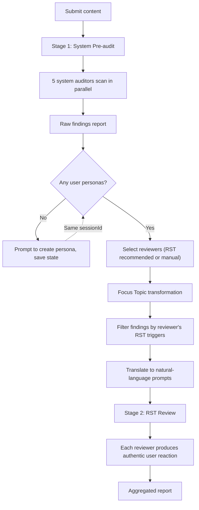

# Kevlar-4u — Comment Section Simulator


🌐 [English](README.md) · [中文](docs/README.zh.md) · [日本語](docs/README.ja.md) · [한국어](docs/README.ko.md)

---

> **It simulates real reactions from different audiences — casual users, picky netizens, technical users, media perspectives — helping you spot expression issues, misunderstandings, and communication risks before you publish.**

---

Drop any content you're about to publish — **articles, tweets, video scripts, product intros, press releases, announcements, Reddit posts, V2EX posts, Hacker News headlines** — directly into Kevlar-4u. It won't just say "looks good." Instead, it'll **question, misinterpret, roast, nitpick, and comprehension-test** your content, just like the real internet.

Writers often suffer from the **"curse of knowledge"**:
You think you've made it clear, but others don't get it.
You think the key point stands out, but readers can't tell what you're trying to say.

And most platforms don't offer a real **A/B test**. Once content goes live, by the time the **first wave of organic traffic** passes, it's usually too late to revise.

**Kevlar-4u helps you surface these problems before you hit publish.**

---

## License

Kevlar-4u's core local features are open-sourced under the **AGPL-3.0** license.

Cloud-based risk word cloud services, paid rule synchronization, and advanced features are **proprietary commercial services**.

---

## Who needs Kevlar

**Indie developers** / **Content creators** / **Product teams** / **PR teams** / Heavy users of X, Reddit, V2EX, Hacker News / Anyone who wants to improve content quality and reach

---

## Core Features

### 1. Highly Customizable Reviewers (Persona Customization)

Break out of the single-AI perspective with comprehensive persona customization:

- **Core attributes**: Age, interests, personality, tone of voice.
- **RST (Reaction Simulation Taxonomy)**: Four-layer internet reaction simulation — choose an archetype (e.g., "Anti-Marketing Detector"), content sensitivity triggers, regional cultural context, and platform culture. The system simulates how real internet users react, not just how reviewers evaluate.
- **Cognition & relationship**: Define blind spots (e.g., domain-specific biases) and social relationship with the author (e.g., a strict mentor, a radical opponent).
- **Natural language creation**: Describe your ideal reviewer in plain text (e.g., "a cynical HN user who hates buzzwords"), and the system auto-parses it into a full RST configuration.

### 2. Two-Stage Review Pipeline

**Stage 1 — System Pre-audit**: Five specialized system auditors scan content in five defensive dimensions:

| Auditor (ID) | Focus |
|---|---|
| 合规哨兵 (`legal_compliance`) | Advertising law violations, false claims, political/legal red lines, industry regulation |
| 社伦判官 (`social_risk`) | Discrimination, stereotyping, moralizing, tone-of-voice risks, reverse-risk ("backfire effect") |
| 语境猎手 (`context_distortion`) | Screenshot out-of-context vulnerability, malicious misinterpretation potential |
| 暗语破译 (`network_culture_risk`) | Internet slang collisions, subculture terminology, hidden vulgar meanings |
| 事实判官 (`factual_integrity`) | Factual errors, common-sense violations, logical fallacies, data credibility |

When independent LLM access is available (MCP Sampling / Direct API), each auditor runs as a separate LLM call for maximum isolation. Under Orchestration fallback, a single-inference **matrix-filling protocol** replaces role-playing — each dimension is a structured XML sandbox slot filled independently, then arbitrated. See [Protocol Comparison](#protocol-comparison-pseudo-parallel-vs-matrix-filling).

**Stage 2 — RST Review**: User-created reviewers with RST personalities receive **Focus Topics** (filtered + translated from pre-audit findings based on each persona's RST triggers) and produce authentic user reactions, not dimension-scored reports.

---

## Quick Start

Requires **Node.js 20+**.

```bash
npm install           # Install dependencies
npm run build         # Compile TypeScript
npm run setup         # Zero-config setup (auto-detect MCP client and write config)
npm run kevlar-4u     # Interactive install CLI (manually select client)
```

Once installed, restart your AI client to start using Kevlar-4u. Supports auto-configuration for:

**Claude Desktop** / **Cursor** / **Windsurf** / **OpenCode** / **Codex** / **Antigravity** / **CodeBuddy CN** / **WorkBuddy**

Local development:

```bash
npm run dev
```

Production start:

```bash
npm start
```

---

## Usage Guide

### Core Workflow

All core operations in Kevlar-4u are handled through Wizard tools — just tell the AI what you want in natural language, and Kevlar-4u takes care of the rest.

### Recommended Tool Flow

| Wizard Tool | Purpose | Key Behavior |
| --- | --- | --- |
| `review_content_wizard` | Review content | Submit content → Select platform → Pick reviewers → Confirm → Multi-dimensional feedback |
| `create_persona_wizard` | Create a persona | Describe the role → Fill 6 attributes (age/interests/traits/tone/platform/relation) → Preview → Confirm → Save persona |
| `delete_persona_wizard` | Delete a persona | Select target → Reply `确认删除{persona name}` → Done |
| `configure_wizard` | Modify config | Preview changes → Reply `确认修改配置` → Write |

Low-level direct tools (suitable for automation scripts):

| Tool | Purpose |
| --- | --- |
| `delete_persona` | Delete persona directly (requires `confirm: true`) |
| `configure` | Write config directly |
| `get_execution_modes` | Check current mode and availability |
| `list_personas` | List local personas |
| `kevlar_help` | View help |

### Content Review Flow

`review_content_wizard` chains "pre-audit, reviewer selection, Focus Topic transformation, RST review" into a stable flow.



### Creating a Reviewer Persona

`create_persona_wizard` guides you through persona creation with RST support.


You can select a traditional perspective preset (9 options) or an **RST archetype** (8 options). RST archetypes auto-configure triggers, regional context, and platform culture. You can also describe your ideal reviewer in natural language (e.g., "a skeptical tech user on HN") and the system will parse it into a full RST config.

After creation, Kevlar-4u automatically infers the cultural background, blind spots, and behavior hints, saving them to `skills/*.json` (routed by platform tag — see [Architecture](#architecture-overview)).

---

## Execution Modes

Kevlar-4u supports three execution modes. The default `auto` selects the best mode based on your environment.

```
                   ┌─────────────────────────────┐
                   │  User submits review request │
                   └─────────────┬───────────────┘
                                 │
                   ┌─────────────▼───────────────┐
                   │  Mode resolution (auto):     │
                   │  1. kevlar-config.json       │
                   │  2. KEVLAR_MODE env          │
                   │  3. Auto-detect capability   │
                   └─────────────┬───────────────┘
                                 │
              ┌──────────────────┼──────────────────┐
              ▼                  ▼                   ▼
   ┌─────────────────┐  ┌─────────────────┐  ┌──────────────────────┐
   │ MCP Sampling    │  │ Direct API      │  │ Orchestration        │
   │                 │  │                 │  │ (Host fallback)      │
   │ Independent     │  │ Independent     │  │ Single-prompt        │
   │ sampling req    │  │ API calls       │  │ host-assisted        │
   │ per persona     │  │ per persona     │  │ sequential persona   │
   │ Max isolation   │  │ Good isolation  │  │ Lower isolation      │
   └─────────────────┘  └─────────────────┘  └──────────────────────┘
```

### Mode details

| Mode | Identifier | Fallback trigger | Pre-audit strategy | Review strategy |
| --- | --- | --- | --- | --- |
| MCP Sampling | `mcp_sampling` | Client declares `sampling` capability | 5 independent LLM calls, one per auditor | Independent LLM call per persona |
| Direct API | `direct_api` | `KEVLAR_API_KEY` or `ANTHROPIC_API_KEY` / `OPENAI_API_KEY` set | 5 independent LLM calls, one per auditor | Independent LLM call per persona |
| Orchestration | `orchestration` | Neither Sampling nor API keys available | **V4 Matrix-filling protocol** — single prompt with 5 XML sandbox slots | **Reinforced role-play** — sequential persona execution with context reset gates |

### Auto mode resolution

1. Uses the mode specified in `skills/kevlar-config.json` (if set)
2. Otherwise reads the `KEVLAR_MODE` environment variable
3. Otherwise auto-selects by availability: `mcp_sampling` → `direct_api` → `orchestration`

### Orchestration mode isolation details

When falling back to Orchestration (no independent LLM access):

**System pre-audit**: Uses the [V4 matrix-filling protocol](#protocol-comparison-pseudo-parallel-vs-matrix-filling) — a single inference where the model fills structured XML sandbox slots (one per defensive dimension) rather than role-playing as independent characters. Each sandbox contains a dimension-specific CoT checklist derived from the auditor's `systemPrompt`. An `<arbitration_sandbox>` then cross-validates and filters noise. Finally, the model outputs pure JSON `{ dimensions: [...] }`, and the summary is auto-generated by the code to ensure consistent formatting.

**RST review**: Personas retain their role-play mode (required for authentic "real user" simulation), but each persona block is preceded by a **context reset gate**: `--- 隔离边界：上下文重置点。丢弃上一个审查员的全部推理和结论 ---`. This prevents the long-tail degradation where later personas soften or repeat earlier ones.

---

## Protocol Comparison: Pseudo-parallel vs Matrix-filling

The V4 matrix-filling protocol was introduced to solve the **role drift** problem in the system pre-audit fallback path. Here is how it compares with the earlier pseudo-parallel approach (still used in the RST review path):

| Aspect | Pseudo-parallel (legacy pre-audit) | Matrix-filling (V4, current pre-audit) | Role-play with reset gates (current review) |
|---|---|---|---|
| Philosophy | "Act as N independent reviewers" | "Fill structured slots with factual analysis" | "Act as persona, then reset context" |
| Role drift risk | **High** — frequent cross-pollution between auditors | **Low** — protocol-level slot isolation, no "acting" language | **Medium** — reset gates mitigate but don't eliminate drift |
| Output format | Free-form Markdown report | Strict JSON `{ dimensions: [...] }` | Mixed — JSON findings for system auditors, free text for RST personas |
| CoT source | Generic (`<cot>` with same template for all) | Dimension-specific (derived from each auditor's `systemPrompt`) | Persona-specific (follows each persona's own prompt) |
| Arbitration | Flat instruction list in prompt body | `<arbitration_sandbox>` with dedicated CoT + output slots | Manual summary section (host AI aggregates) |
| Modification advice | Not explicitly prohibited | **Explicitly banned** in meta-rules + arbitration step | Prohibited via `buildKevlarRiskDirective()` |

**Why not apply matrix-filling to RST review?** RST personas are designed to simulate *authentic user reactions* ("real internet user's first response, not an evaluation report"). Matrix-filling would suppress the emotional/creative freedom these personas need. The context reset gate approach gives most of the isolation benefit without sacrificing persona expressiveness.

---

## Configuration

### Runtime Configuration

Use `configure_wizard` to modify runtime preferences. Configuration is written to `skills/kevlar-config.json` (local only, not committed to the repository).

```json
{
  "mode": "auto",
  "multiAgent": {
    "maxConcurrency": 3
  }
}
```

### Environment Variables

| Variable | Default | Description |
| --- | --- | --- |
| `KEVLAR_MODE` | `auto` | `auto`, `orchestration`, `mcp_sampling`, `direct_api` |
| `KEVLAR_MAX_CONCURRENT` | `3` | Max concurrent reviewers |
| `KEVLAR_TOKEN_BUDGET_PER_TASK` | `50000` | Token budget per review task |
| `KEVLAR_MIN_DELAY_MS` | `1000` | Minimum delay between requests |
| `KEVLAR_SKILLS_DIR` | `<repo>/skills` | Custom persona and config directory |
| `KEVLAR_API_KEY` | — | Preferred Direct API key |
| `ANTHROPIC_API_KEY` | — | Anthropic API key |
| `OPENAI_API_KEY` | — | OpenAI API key |
| `LOG_LEVEL` | `info` | `debug`, `info`, `warn`, `error` |

> API keys are read from environment variables only — they are never written to config files.

### Manual MCP Client Configuration

Claude Desktop example:

```json
{
  "mcpServers": {
    "kevlar-4u": {
      "command": "node",
      "args": ["/ABSOLUTE/PATH/TO/kevlar-4u/dist/index.js"],
      "env": {
        "KEVLAR_MODE": "auto",
        "KEVLAR_MAX_CONCURRENT": "3"
      }
    }
  }
}
```

Custom persona directory:

```json
{
  "env": {
    "KEVLAR_SKILLS_DIR": "/ABSOLUTE/PATH/TO/skills"
  }
}
```

---

## Security Boundaries

- `sessionId` only allows `[a-z0-9-]`.
- Persona write and delete operations are restricted to the `skills/` directory via path validation.
- Runtime drafts and wizard states are stored in `skills/tmp/`, with expired drafts cleaned up on startup.
- Deleting a persona requires selecting a target and replying with the full confirmation phrase.
- Config changes require preview before confirmation.
- API keys are never passed via tool parameters or written to local config.
- Non-`orchestration` modes use a review lock to prevent resource contention between multiple external model tasks.

---

## Architecture Overview

Kevlar-4u uses a **Server-side Workflow + Execution Layer** architecture.


Design principles:

- **State machine-driven workflows**: Key flows are maintained by tool state machines, not dependent on the host AI remembering long prompts.
- **AI handles understanding & expression**: AI handles natural language extraction, refinement, and recommendations, while results are written to Kevlar-4u-verifiable state.
- **Adaptive execution**: When MCP Sampling is available, use it for field extraction and reviewer recommendations; otherwise, fall back to heuristic logic or host-assisted orchestration.
- **Safe confirmation**: High-risk operations like deletion, reset, and config writes all go through confirmation wizards.

### Directory Structure

```text
kevlar-4u/
├── config/
│   └── mcp-config.json                    # MCP client config template
├── docs/                                  # Architecture decisions, ADRs, audit reports
├── schedule/                              # RST design docs & phase logs
│   ├── RST-ARCHITECTURE.md                # RST four-layer architecture
│   ├── RST-需求文档.md                     # RST requirements
│   └── RST-PHASE-LOG.md                   # RST implementation phase log
├── scripts/                               # Install & config scripts
│   ├── cli.ts                             # Interactive install CLI
│   ├── registry.ts                        # MCP client detection
│   └── setup.ts                           # Zero-config setup script
├── skills/                                # Reviewer persona library
│   ├── auditors.json                      # System auditors (pre-screening)
│   ├── xiaohongshu.json                   # Platform: 小红书
│   ├── zhihu.json                         # Platform: 知乎
│   ├── wechat_official.json               # Platform: 微信公众号
│   ├── rules.json                         # Semantic risk rules (DAO layer)
│   ├── _template.md                       # (Legacy) Persona reference template
│   └── tmp/                               # Runtime wizard session state
├── src/
│   ├── index.ts                           # stdio server entry
│   ├── server.ts                          # MCP server, DI, tool registration
│   ├── __tests__/                         # Test suite
│   ├── execution/                         # Multi-mode execution layer
│   │   ├── index.ts                       # Execution entry, mode resolution
│   │   ├── base.ts                        # Type definitions & interfaces
│   │   ├── client.ts                      # Client capability detection
│   │   ├── config.ts                      # Config read/write
│   │   ├── aggregator.ts                  # Review report aggregation
│   │   ├── limiter.ts                     # Concurrency limiting & retry
│   │   ├── lock.ts                        # Review lock
│   │   ├── parallel.ts                    # Shared parallel execution + RST prompt builder
│   │   ├── dimensions.ts                  # Review dimensions + RST four-layer definitions
│   │   ├── focusTopicTransform.ts         # Focus Topic filter + translate pipeline
│   │   ├── rstParser.ts                   # Natural language → RST config parser
│   │   ├── rstRecommender.ts              # RST-based persona recommendation engine
│   │   └── modes/
│   │       ├── orchestration.ts
│   │       ├── sampling.ts
│   │       └── direct_api.ts
│   ├── tools/                             # MCP tools
│   │   ├── index.ts                       # Tool registry
│   │   ├── listPersonasTool.ts
│   │   ├── createPersonaTool.ts           # Create persona + draft management
│   │   ├── createPersonaWizardTool.ts     # Wizard with RST archetype selection
│   │   ├── deletePersonaTool.ts
│   │   ├── deletePersonaWizardTool.ts
│   │   ├── reviewTool.ts
│   │   ├── reviewContentWizardTool.ts
│   │   ├── configureTool.ts
│   │   ├── configureWizardTool.ts
│   │   ├── getModesTool.ts
│   │   └── helpTool.ts
│   ├── dao/                               # Data Access Layer
│   │   ├── IRuleRepository.ts             # Rule repository interface
│   │   ├── LocalJsonRuleRepository.ts     # Local JSON implementation
│   │   ├── index.ts                       # DAO entry point
│   │   └── types.ts                       # Rule data types
│   ├── prompts/
│   │   └── reviewDispatcherPrompt.ts      # Internal design reference
│   └── utils/
│       ├── errors.ts                      # Error codes & formatting
│       ├── logger.ts                      # Structured logging
│       ├── parser.ts                      # Multi-file JSON persona parsing & writing
│       ├── sanitize.ts                    # Credential scanning, prompt boundary handling
│       └── ...
└── package.json
```

---

## Data Storage

### Personas

Personas are stored in **multi-file JSON** format under `skills/`. Each persona file contains a `version`, `last_updated`, and `personas` map:

```json
{
  "version": "1.0.0",
  "last_updated": "2026-05-28",
  "personas": {
    "analytical_zhihu": {
      "meta": {
        "id": "analytical_zhihu",
        "name": "理性知乎人",
        "tags": ["知乎", "理性分析"],
        "tone": ["专业", "严谨"],
        "dimensionBias": {
          "entries": [
            { "dimension": "information_gap", "weight": "focus" },
            { "dimension": "differentiation", "weight": "focus" }
          ]
        },
        "rst": {
          "archetypes": ["technical_reviewer"],
          "triggers": ["ai_writing", "overhyped", "data_credibility"],
          "regionalPack": "china",
          "platformCulture": "zhihu"
        }
      },
      "systemPrompt": "你是一位活跃在知乎的用户..."
    }
  }
}
```

Files are routed by tag:

| Tag | Target File | Purpose |
| --- | --- | --- |
| `system_auditor` | `auditors.json` | System pre-screening auditors |
| `"小红书"` | `xiaohongshu.json` | Platform-specific user personas |
| `"知乎"` | `zhihu.json` | Platform-specific user personas |
| *(unknown)* | `fallback.json` | Catch-all for unrecognised platforms |

New persona files are auto-detected at startup via content sniffing (presence of a `personas` key). Adding a new platform requires only placing a JSON file in `skills/`.

### Rules

Semantic risk rules live in `skills/rules.json` and are accessed through the DAO layer (`src/dao/`):

```json
{
  "version": "1.0.0",
  "categories": {
    "food": {
      "enabled": true,
      "associative_map": [
        {
          "root": "不新鲜",
          "variants": ["食材不新鲜", "东西不新鲜"],
          "misinterpret_direction": "可能被误解为食品安全问题",
          "severity": "medium"
        }
      ]
    }
  }
}
```

### Creating Personas

Use the `create_persona_wizard` tool — it guides you through age, interests, traits, tone, platform, author relation, and **RST archetype selection**. You can also describe your ideal reviewer in natural language (e.g., "a sarcastic tech user on Hacker News who hates marketing fluff") and the system will auto-parse it into a full RST configuration. The persona is automatically saved to the correct platform JSON file. No manual file editing is needed.

---

## Pre-Release Checklist

```bash
npm run build
npm test
```

Before release, it is recommended to hand [docs/PRE_RELEASE_AUDIT_REQUEST.md](docs/PRE_RELEASE_AUDIT_REQUEST.md) to your local AI for an independent audit.
