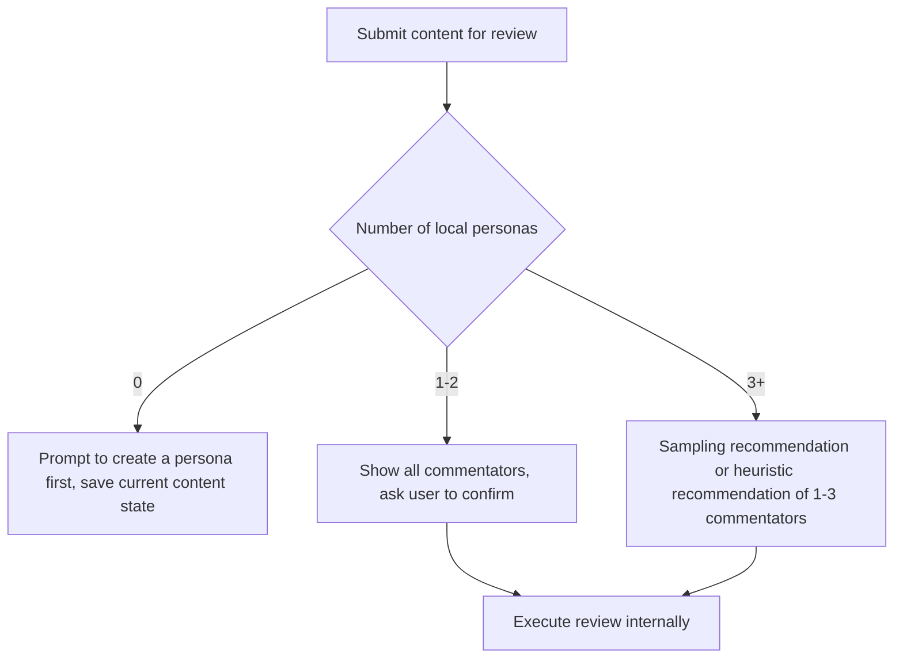
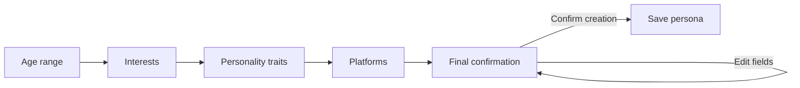
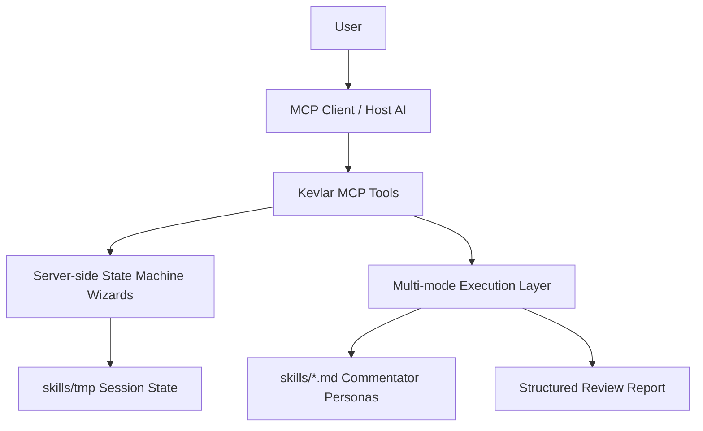

# Kevlar — Feedback Simulator Before You Hit Publish


🌐 [English](README.md) · [中文](docs/README.zh.md) · [日本語](docs/README.ja.md) · [한국어](docs/README.ko.md)

---

> **It simulates real reactions from different audiences — casual users, picky netizens, technical users, media perspectives — helping you spot expression issues, misunderstandings, and communication risks before you publish.**

---

Drop any content you're about to publish — **articles, tweets, video scripts, product intros, press releases, announcements, Reddit posts, V2EX posts, Hacker News headlines** — directly into Kevlar. It won't just say "looks good." Instead, it'll **question, misinterpret, roast, nitpick, and comprehension-test** your content, just like the real internet.

Writers often suffer from the **"curse of knowledge"**:
You think you've made it clear, but others don't get it.
You think the key point stands out, but readers can't tell what you're trying to say.

And most platforms don't offer a real **A/B test**. Once content goes live, by the time the **first wave of organic traffic** passes, it's usually too late to revise.

**Kevlar helps you surface these problems before you hit publish.**

## Who needs Kevlar

**Indie developers** / **Content creators** / **Product teams** / **PR teams** / Heavy users of X, Reddit, V2EX, Hacker News / Anyone who wants to improve content quality and reach

---

## Core Features

### 1. Highly Customizable Virtual Commentators (Persona Customization)

Break out of the single-AI perspective with comprehensive persona customization:

- **Core attributes**: Age, interests, personality, stance.
- **Cognition & relationship**: Define blind spots (e.g., domain-specific biases) and social relationship with the author (e.g., a strict mentor, a radical opponent).
- **Cultural adaptation**: The system automatically detects the language of input content and infers a matching localized cultural context.

### 2. Fully Automated Feedback Pipeline

- **Smart dispatch**: Paste your work and the AI dispatcher automatically analyzes the content's characteristics.
- **Precise matching**: Dynamically filters and schedules the most relevant virtual commentators.
- **Multi-dimensional collision**: Triggers differentiated comments and feedback from diverse stances and professional perspectives.

---

## Quick Start

Requires **Node.js 20+**.

```bash
npm install           # Install dependencies
npm run build         # Compile TypeScript
npm run setup         # Zero-config setup (auto-detect MCP client and write config)
npm run kevlar-mcp    # Interactive install CLI (manually select client)
```

Once installed, restart your AI client to start using Kevlar. Supports auto-configuration for:

**Claude Desktop** / **Cursor** / **Windsurf** / **OpenCode** / **Codex** / **Antigravity** / **CodeBuddy CN** / **WorkBuddy**

Local development:

```bash
npm run dev
```

Production start:

```bash
npm start
```

---

## Usage Guide

### Core Workflow

All core operations in Kevlar are handled through Wizard tools — just tell the AI what you want in natural language, and Kevlar takes care of the rest.

### Recommended Tool Flow

| Wizard Tool | Purpose | Key Behavior |
| --- | --- | --- |
| `review_content_wizard` | Review content | Submit content → Select commentators → Confirm → Multi-dimensional feedback |
| `create_persona_wizard` | Create a persona | Describe the role → AI extracts fields → Final confirmation → Save persona |
| `delete_persona_wizard` | Delete a persona | Select target → Reply `confirm delete {persona name}` → Done |
| `configure_wizard` | Modify config | Preview changes → Reply `confirm config changes` → Write |

Low-level direct tools (suitable for automation scripts):

| Tool | Purpose |
| --- | --- |
| `create_persona` | Create persona directly or from draft |
| `delete_persona` | Delete persona directly (requires `confirm: true`) |
| `configure` | Write config directly |
| `get_execution_modes` | Check current mode and availability |
| `list_personas` | List local personas |
| `kevlar_help` | View help |

### Content Review Flow

`review_content_wizard` chains "save content, select commentators, confirm execution" into a stable flow.



### Creating a Commentator Persona

`create_persona_wizard` guides you through persona creation step by step.



After creation, Kevlar automatically infers the cultural background, relationship with author, stance, and blind spots, saving them to `skills/*.md`.

---

## Execution Modes

Kevlar supports three execution modes. The default `auto` selects the best mode based on your environment.

| Mode | Identifier | Description | Best for |
| --- | --- | --- | --- |
| MCP Sampling | `mcp_sampling` | Each commentator gets an independent sampling request, maximum isolation | Clients that support Sampling, pursuing authentic multi-perspective review |
| Direct API | `direct_api` | Directly calls external model API | Clients without Sampling, or script automation |
| Orchestration (Host-assisted fallback) | `orchestration` | Host AI assists completion, low-isolation fallback | Last resort when neither Sampling nor API Key is available |

`auto` mode resolution order:

1. Uses the mode specified in `skills/kevlar-config.json` (if set)
2. Otherwise reads the `KEVLAR_MODE` environment variable
3. Otherwise auto-selects by availability: `mcp_sampling` → `direct_api` → `orchestration`

---

## Configuration

### Runtime Configuration

Use `configure_wizard` to modify runtime preferences. Configuration is written to `skills/kevlar-config.json` (local only, not committed to the repository).

```json
{
  "mode": "auto",
  "multiAgent": {
    "maxConcurrency": 3
  }
}
```

### Environment Variables

| Variable | Default | Description |
| --- | --- | --- |
| `KEVLAR_MODE` | `auto` | `auto`, `orchestration`, `mcp_sampling`, `direct_api` |
| `KEVLAR_MAX_CONCURRENT` | `3` | Max concurrent commentators |
| `KEVLAR_TOKEN_BUDGET_PER_TASK` | `50000` | Token budget per review task |
| `KEVLAR_MIN_DELAY_MS` | `1000` | Minimum delay between requests |
| `KEVLAR_SKILLS_DIR` | `<repo>/skills` | Custom persona and config directory |
| `KEVLAR_API_KEY` | — | Preferred Direct API key |
| `ANTHROPIC_API_KEY` | — | Anthropic API key |
| `OPENAI_API_KEY` | — | OpenAI API key |
| `LOG_LEVEL` | `info` | `debug`, `info`, `warn`, `error` |

> API keys are read from environment variables only — they are never written to config files.

### Manual MCP Client Configuration

Claude Desktop example:

```json
{
  "mcpServers": {
    "kevlar": {
      "command": "node",
      "args": ["/ABSOLUTE/PATH/TO/kevlar/dist/index.js"],
      "env": {
        "KEVLAR_MODE": "auto",
        "KEVLAR_MAX_CONCURRENT": "3"
      }
    }
  }
}
```

Custom persona directory:

```json
{
  "env": {
    "KEVLAR_SKILLS_DIR": "/ABSOLUTE/PATH/TO/skills"
  }
}
```

---

## Security Boundaries

- `sessionId` only allows `[a-z0-9-]`.
- Persona write and delete operations are restricted to the `skills/` directory via path validation.
- Runtime drafts and wizard states are stored in `skills/tmp/`, with expired drafts cleaned up on startup.
- Deleting a persona requires selecting a target and replying with the full confirmation phrase.
- Config changes require preview before confirmation.
- API keys are never passed via tool parameters or written to local config.
- Non-`orchestration` modes use a review lock to prevent resource contention between multiple external model tasks.

---

## Architecture Overview

Kevlar uses a **Server-side Workflow + Execution Layer** architecture.



Design principles:

- **State machine-driven workflows**: Key flows are maintained by tool state machines, not dependent on the host AI remembering long prompts.
- **AI handles understanding & expression**: AI handles natural language extraction, refinement, and recommendations, while results are written to Kevlar-verifiable state.
- **Adaptive execution**: When MCP Sampling is available, use it for field extraction and commentator recommendations; otherwise, fall back to heuristic logic or host-assisted orchestration.
- **Safe confirmation**: High-risk operations like deletion, reset, and config writes all go through confirmation wizards.

### Directory Structure

```text
kevlar/
├── config/
│   └── mcp-config.json                    # MCP client config template
├── docs/                                  # Architecture design, audit reports
├── scripts/                               # Install & config scripts
│   ├── cli.ts                             # Interactive install CLI
│   ├── registry.ts                        # MCP client detection
│   └── setup.ts                           # Zero-config setup script
├── skills/                                # Commentator persona library
│   ├── _template.md                       # Persona template
│   └── tmp/                               # Runtime wizard session state
├── src/
│   ├── index.ts                           # stdio server entry
│   ├── server.ts                          # MCP server, DI, tool registration
│   ├── __tests__/                         # Test suite
│   ├── execution/                         # Multi-mode execution layer
│   │   ├── index.ts                       # Execution entry, mode resolution
│   │   ├── base.ts                        # Type definitions & interfaces
│   │   ├── client.ts                      # Client capability detection
│   │   ├── config.ts                      # Config read/write
│   │   ├── aggregator.ts                  # Review report aggregation
│   │   ├── limiter.ts                     # Concurrency limiting & retry
│   │   ├── lock.ts                        # Review lock
│   │   ├── parallel.ts                    # Shared parallel execution
│   │   └── modes/
│   │       ├── orchestration.ts
│   │       ├── sampling.ts
│   │       └── direct_api.ts
│   ├── tools/                             # MCP tools
│   │   ├── index.ts                       # Tool registry
│   │   ├── listPersonasTool.ts
│   │   ├── createPersonaTool.ts           # Create persona + draft management
│   │   ├── createPersonaWizardTool.ts
│   │   ├── deletePersonaTool.ts
│   │   ├── deletePersonaWizardTool.ts
│   │   ├── reviewTool.ts
│   │   ├── reviewContentWizardTool.ts
│   │   ├── configureTool.ts
│   │   ├── configureWizardTool.ts
│   │   ├── getModesTool.ts
│   │   └── helpTool.ts
│   ├── prompts/
│   │   └── reviewDispatcherPrompt.ts      # Internal design reference
│   └── utils/
│       ├── errors.ts                      # Error codes & formatting
│       ├── logger.ts                      # Structured logging
│       ├── parser.ts                      # Persona file parsing & writing
│       ├── sanitize.ts                    # Credential scanning, prompt boundary handling
│       └── ...
└── package.json
```

---

## Contributing Commentator Personas

Add a subdirectory and `.md` file under `skills/` by platform (or place it directly in the `skills/` root). Custom persona files are excluded by `.gitignore` by default and will not be committed to the repository.

Refer to the template `skills/_template.md`:

```markdown
---
id: your_persona_id
name: Display name
description: One-line description of what this commentator focuses on
tags:
  - Platform
  - Interest
author: custom
---

Age range:
Interests:
Platforms:
Personality traits:
- Trait → Behavior

Cultural background:
Relationship with author:
Stance:
Blind spots:
```

Custom personas undergo field completeness validation before participating in reviews. At minimum, platforms, personality traits, blind spots, and similar information must be parseable or present in the description.

---

## Pre-Release Checklist

```bash
npm run build
npm test
```

Before release, it is recommended to hand [docs/PRE_RELEASE_AUDIT_REQUEST.md](docs/PRE_RELEASE_AUDIT_REQUEST.md) to your local AI for an independent audit.
