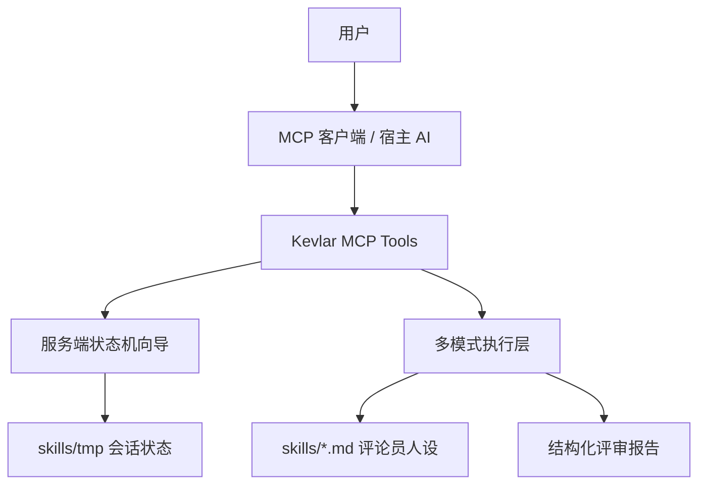
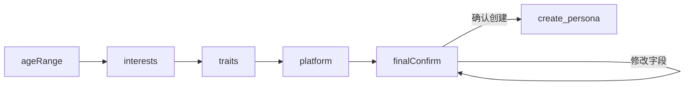
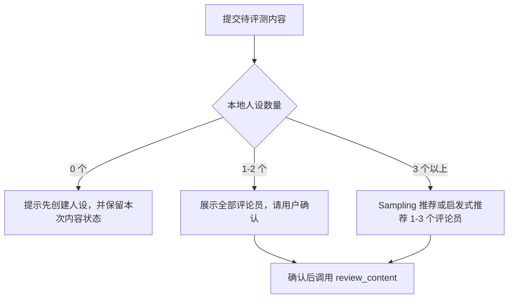

# Kevlar MCP Server

> Kevlar is a local-first MCP server for content stress testing. It lets an AI client run structured reader-persona reviews before your content meets the real internet.

Kevlar 是一个本地优先的 MCP 内容评审服务。它把“评论员人设”“评审流程”“执行模式”“配置修改”等关键逻辑放到服务端工具里维护，宿主 AI 负责理解用户意图、调用工具、展示工具返回的信息。

---

## 当前架构

Kevlar 现在采用 **Server-side Workflow + Execution Layer** 架构：



核心原则：

- 关键流程由工具状态机维护，不依赖宿主 AI 记住长提示词。
- AI 仍负责自然语言提炼、润色和推荐，但结果会写入 Kevlar 可验证状态。
- 支持 MCP Sampling 时，Kevlar 会用 Sampling 做字段提炼或评论员推荐；不支持时自动走启发式逻辑或宿主辅助兜底。
- 删除、重置、配置写入等高风险操作都通过确认向导执行。

---

## 核心能力

- **内容压力测试**：用一个或多个评论员人设审查文案、脚本、帖子、宣发内容。
- **服务端状态机向导**：创建人设、评审内容、删除人设、恢复默认人设、修改配置都有独立 wizard 工具。
- **动态人设创建**：用户自然描述角色，AI 负责提炼，Kevlar 负责保存结构化草稿并最终写入 `.md` 人设文件。
- **多执行模式**：支持 `mcp_sampling`、`direct_api`、`orchestration`，`auto` 会按环境自动选择。
- **本地优先**：人设、草稿、配置默认保存在本地 `skills/` 目录，不把 API Key 写入配置文件。
- **安全确认**：删除、重置、配置修改必须回复完整确认语才会真正执行。

---

## 推荐工具流

优先让宿主 AI 调用这些向导工具，而不是直接靠 prompt 自行推进流程。

| 工具 | 用途 | 关键行为 |
| --- | --- | --- |
| `create_persona_wizard` | 创建评论员人设 | 年龄段 -> 兴趣方向 -> 性格特质 -> 平台 -> 最终确认。中间步骤不反复确认，最终确认阶段可修改字段。 |
| `review_content_wizard` | 内容评审流程 | 暂存内容，检查人设库，推荐或展示评论员，用户确认后执行评审。 |
| `delete_persona_wizard` | 删除人设 | 匹配并绑定删除目标，要求回复 `确认删除{人设名}`。 |
| `reset_personas_wizard` | 恢复默认评论员 | 展示影响范围，要求回复 `确认恢复默认评论员`。 |
| `configure_wizard` | 修改运行配置 | 解析配置意图，预览变更，要求回复 `确认修改配置` 后写入。 |

底层直调工具仍保留，适合测试、脚本或已具备完整参数的场景：

| 工具 | 用途 |
| --- | --- |
| `review_content` | 直接执行内容评审 |
| `create_persona` | 直接创建人设，或基于已完成草稿创建 |
| `delete_persona` | 直接删除指定人设，需要 `confirm: true` |
| `reset_personas` | 直接恢复默认人设，需要 `confirm: true` |
| `configure` | 直接写入配置 |
| `get_execution_modes` | 查看当前模式、可用性和推荐模式 |
| `list_personas` | 列出本地人设 |
| `kevlar_help` | 查看使用帮助 |

`update_persona_draft` 和 `delete_persona_draft` 是兼容旧流程的草稿工具，新流程通常由 `create_persona_wizard` 自动维护草稿。

---

## 人设创建流程

`create_persona_wizard` 是当前推荐入口。



行为说明：

- 第一步询问年龄段，例如 `25-30岁（职场新人）`。
- 每个字段记录后直接进入下一步，不做单字段确认。
- 兴趣方向和性格特质可由 MCP Sampling 提炼；没有 Sampling 时用本地启发式拆分。
- 所有字段收集完后只做一次最终确认。
- 最终确认阶段可以说 `年龄段改成30-35岁（职场中坚）`、`兴趣方向改成设计、摄影` 等，Kevlar 会更新草稿并重新展示最终确认。
- 用户确认后，Kevlar 自动推断文化背景、与作者关系、立场、盲区，并写入 `skills/*.md`。

---

## 内容评审流程

`review_content_wizard` 负责把“内容暂存、评论员选择、确认执行”串成稳定流程。



评审执行由 `src/execution/` 统一处理，包括模式解析、预算检查、并发锁、限流重试和报告聚合。

---

## 执行模式

Kevlar 支持三种执行模式。默认 `auto` 会按环境自动选择。

| 模式 | 标识符 | 说明 | 适用场景 |
| --- | --- | --- | --- |
| MCP Sampling 模式 | `mcp_sampling` | 为每个评论员发起独立 MCP Sampling 请求，隔离度最高。 | 客户端支持 Sampling，追求真实多视角评审。 |
| Direct API 模式 | `direct_api` | Kevlar 直接调用外部模型 API。 | 无 Sampling 客户端，或需要脚本自动化评审。 |
| 宿主辅助兜底模式 | `orchestration` | 将评审任务交给宿主 AI 辅助完成，低隔离 fallback。 | 无 Sampling、无 API Key 时的最后兜底。 |

`auto` 模式解析顺序：

1. 如果 `skills/kevlar-config.json` 指定了非 `auto` 模式，优先使用该配置。
2. 否则读取 `KEVLAR_MODE` 环境变量。
3. 否则按可用性和优先级选择：`mcp_sampling` -> `direct_api` -> `orchestration`。

---

## 目录结构

```text
kevlar/
├── config/
│   └── mcp-config.json
├── docs/
│   ├── SPEC-execution-modes.md
│   └── PRE_RELEASE_AUDIT_REQUEST.md
├── skills/
│   ├── _template.md
│   ├── impatient_passerby.md
│   ├── keyboard_warrior.md
│   ├── first_time_reader.md
│   └── tmp/                         # 运行时会话状态，测试或运行时生成
├── src/
│   ├── index.ts                     # stdio server 入口
│   ├── server.ts                    # MCP server、tools、prompts 注册与分发
│   ├── execution/                   # 多执行模式与评审执行层
│   │   ├── index.ts
│   │   ├── base.ts
│   │   ├── client.ts
│   │   ├── config.ts
│   │   ├── aggregator.ts
│   │   ├── limiter.ts
│   │   ├── lock.ts
│   │   └── modes/
│   │       ├── orchestration.ts
│   │       ├── sampling.ts
│   │       └── direct_api.ts
│   ├── tools/
│   │   ├── createPersonaWizardTool.ts
│   │   ├── reviewContentWizardTool.ts
│   │   ├── deletePersonaWizardTool.ts
│   │   ├── resetPersonasWizardTool.ts
│   │   ├── configureWizardTool.ts
│   │   ├── createPersonaTool.ts
│   │   ├── reviewTool.ts
│   │   └── ...
│   ├── prompts/
│   │   └── reviewDispatcherPrompt.ts
│   └── utils/
│       ├── parser.ts
│       ├── errors.ts
│       └── logger.ts
└── package.json
```

---

## 快速开始

要求 Node.js 20+。

```bash
npm install
npm run build
npm test
```

本地开发：

```bash
npm run dev
```

生产启动：

```bash
npm start
```

---

## MCP 客户端配置

Claude Desktop 示例：

```json
{
  "mcpServers": {
    "kevlar": {
      "command": "node",
      "args": ["/ABSOLUTE/PATH/TO/kevlar/dist/index.js"],
      "env": {
        "KEVLAR_MODE": "auto",
        "KEVLAR_MAX_CONCURRENT": "3"
      }
    }
  }
}
```

如果要使用自定义人设目录：

```json
{
  "env": {
    "KEVLAR_SKILLS_DIR": "/ABSOLUTE/PATH/TO/skills"
  }
}
```

Cursor 或其他 MCP 客户端中，使用命令：

```bash
node /ABSOLUTE/PATH/TO/kevlar/dist/index.js
```

---

## 配置

用户偏好配置写入 `skills/kevlar-config.json`。该文件应保持本地化，不提交到仓库。

推荐通过 `configure_wizard` 修改配置。它会先预览变更，只有用户回复完整确认语 `确认修改配置` 后才会写入。

示例配置：

```json
{
  "mode": "auto",
  "multiAgent": {
    "maxConcurrency": 3
  }
}
```

环境变量：

| 环境变量 | 默认值 | 说明 |
| --- | --- | --- |
| `KEVLAR_SKILLS_DIR` | `<repo>/skills` | 自定义人设与配置目录 |
| `KEVLAR_MODE` | `auto` | `auto`、`orchestration`、`mcp_sampling`、`direct_api` |
| `KEVLAR_API_KEY` | 无 | Direct API 首选 Key |
| `ANTHROPIC_API_KEY` | 无 | Anthropic API Key |
| `OPENAI_API_KEY` | 无 | OpenAI API Key |
| `KEVLAR_TOKEN_BUDGET_PER_TASK` | `50000` | 单次评审预算上限 |
| `KEVLAR_MAX_CONCURRENT` | `3` | 多评论员执行最大并发 |
| `KEVLAR_MIN_DELAY_MS` | `1000` | 请求间最小延迟 |
| `LOG_LEVEL` | `info` | `debug`、`info`、`warn`、`error` |

API Key 只从环境变量读取，不写入 `kevlar-config.json`。

---

## Prompts 与降级说明

Kevlar 仍注册了 MCP Prompts：

- `create_persona`
- `review_content`

这些 prompt 现在是兼容旧客户端的动态上下文提示，不是主流程真相源。主流程应以 wizard 工具返回的 `kevlar-state` 为准。

对于创建人设，`SYSTEM_PROMPT` 也保留在 `createPersonaTool.ts` 中作为旧流程兼容说明。新流程不要求宿主 AI 修改 system prompt，而是通过 `create_persona_wizard` 把步骤状态、字段提炼和最终写入交给 Kevlar 服务端维护。

---

## 安全边界

- `sessionId` 只允许 `[a-z0-9-]`。
- 人设写入和删除都通过路径校验限制在 `skills/` 内。
- 运行时草稿和向导状态写入 `skills/tmp/`，启动时会清理过期草稿。
- 删除人设必须绑定目标并回复完整确认语。
- 恢复默认人设不会删除自定义角色。
- 配置修改必须先预览再确认。
- API Key 不通过工具参数传递，不写入本地配置。
- 非 `orchestration` 执行模式会使用评审锁，避免多个外部模型任务同时竞争资源。

---

## 贡献评论员人设

在 `skills/` 下新增 `.md` 文件：

```markdown
---
id: your_persona_id
name: 角色显示名称
description: 一句话描述这个评论员关注什么问题
tags:
  - 小红书
  - 设计
author: custom
---

年龄段：
兴趣方向：
常用平台：
性格特质：
- 特质 → 行为

文化背景：
与作者的关系：
立场：
盲区：
```

自定义人设参与评审前会做字段完整性校验。至少要保证常用平台、性格特质、盲区等信息可被解析或出现在描述中。

---

## 发布前检查

```bash
npm run build
npm test
```

上线前建议使用 [docs/PRE_RELEASE_AUDIT_REQUEST.md](docs/PRE_RELEASE_AUDIT_REQUEST.md) 交给本地 AI 做一次独立审计。
