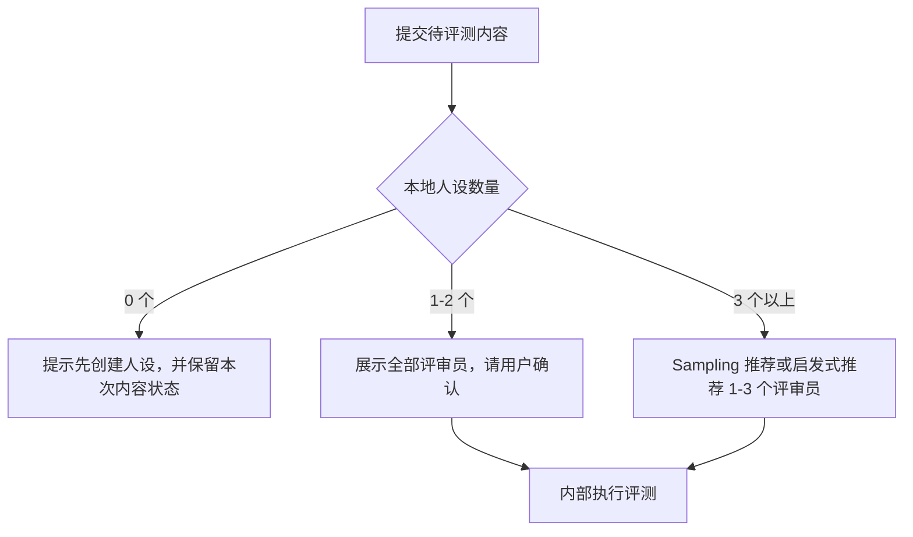
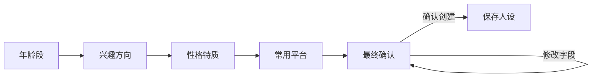
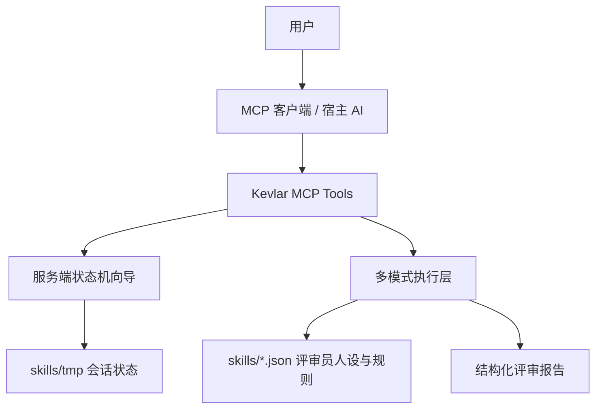

# Kevlar — 社交媒体作品发布前的反馈模拟器


🌐 [English](README.md) · [中文](README.zh.md) · [日本語](README.ja.md) · [한국어](README.ko.md)

---

> **它会模拟普通用户、挑剔网友、技术用户、媒体视角等不同人群的真实反应，帮你提前发现表达问题、误解点与传播风险。**

---

你可以把准备发布的内容——**文章、推文、视频脚本、产品介绍、新闻稿、公告、Reddit 帖子、V2EX 帖子、Hacker News 标题**——直接丢给 Kevlar。它不会只告诉你"写得不错"，而是像真实互联网一样，对内容进行**质疑、误解、吐槽、挑刺与理解测试**。

很多时候，作者已经陷入**"当局者迷"**：
你以为讲清楚了，但别人根本没看懂；
你以为重点很突出，但用户甚至不知道你到底想表达什么。

而大多数平台几乎不给真正的 **A/B 测试**机会。内容一旦发出去，**第一波自然流量**过去后，再修改往往已经太晚。

**Kevlar 的作用，就是帮你在正式发布前，提前暴露这些问题。**

## 谁会需要 Kevlar

**独立开发者** / **自媒体创作者** / **产品团队** / **PR 团队** / 经常发 X、Reddit、V2EX、Hacker News 的用户 / 想提升内容表达与传播效果的人

---

## 核心特性

### 1. 高度定制的评审员（Persona Customization）

打破单一的 AI 视角，支持全方位的评审员画像定制：

- **核心属性**：年龄、兴趣、性格、立场。
- **认知与关系**：自定义其认知盲区（如特定领域的偏见）以及与作者的社交关系（如严苛的导师、激进的反对者）。
- **文化自适应**：系统会根据输入内容的语言，由 AI 自动推断并匹配契合的本地化文化背景。

### 2. 全自动反馈流水线（Automated Feedback Pipeline）

- **智能调度**：粘贴作品后，AI 调度员会自动解析文本的内容特征。
- **精准匹配**：动态筛选并调度最合适的评审员。
- **多维碰撞**：即时触发来自不同立场、不同专业视角的差异化评论与反馈。

---

## 快速开始

要求 **Node.js 20+**。

```bash
npm install           # 安装依赖
npm run build         # 编译 TypeScript
npm run setup         # 零配置安装（自动检测 MCP 客户端并写入配置）
npm run kevlar-4u    # 交互式安装 CLI（手动选择客户端）
```

安装完成后重启 AI 客户端即可开始使用。支持以下客户端自动配置：

**Claude Desktop** / **Cursor** / **Windsurf** / **OpenCode** / **Codex** / **Antigravity** / **CodeBuddy CN** / **WorkBuddy**

本地开发：

```bash
npm run dev
```

生产启动：

```bash
npm start
```

---

## 使用指南

### 核心流程

Kevlar 的所有核心操作都通过向导工具（Wizard）完成，你只需要用自然语言告诉 AI 你想做什么，剩下的步骤由 Kevlar 自动推进。

### 推荐工具流

| 向导工具 | 用途 | 关键行为 |
| --- | --- | --- |
| `review_content_wizard` | 评审内容 | 提交文案 → 选择评审员 → 确认 → 输出多维反馈 |
| `create_persona_wizard` | 创建评审员 | 描述角色 → AI 提炼字段 → 最终确认 → 保存人设 |
| `delete_persona_wizard` | 删除人设 | 选择目标 → 回复 `确认删除{人设名}` → 完成 |
| `configure_wizard` | 修改配置 | 预览变更 → 回复 `确认修改配置` → 写入 |

底层直调工具（适合自动化脚本）：

| 工具 | 用途 |
| --- | --- |
| `create_persona` | 直接创建人设或基于草稿创建 |
| `delete_persona` | 直接删除人设（需 `confirm: true`） |
| `configure` | 直接写入配置 |
| `get_execution_modes` | 查看当前模式和可用性 |
| `list_personas` | 列出本地人设 |
| `kevlar_help` | 查看帮助 |

### 内容评审流程

`review_content_wizard` 负责把"内容暂存、评审员选择、确认执行"串成稳定流程。



### 创建评审员人设

`create_persona_wizard` 会引导你逐步完成人设创建。



创建完成后，Kevlar 会自动推断文化背景、与作者关系、立场和盲区，保存到对应平台的 `skills/*.json`。

---

## 执行模式

Kevlar 支持三种执行模式。默认 `auto` 会按环境自动选择。

| 模式 | 标识符 | 说明 | 适用场景 |
| --- | --- | --- | --- |
| MCP Sampling 模式 | `mcp_sampling` | 每个评审员发起独立采样请求，隔离度最高 | 客户端支持 Sampling，追求真实多视角评审 |
| Direct API 模式 | `direct_api` | 直接调用外部模型 API | 无 Sampling 客户端，或需要脚本自动化 |
| 宿主辅助兜底模式 | `orchestration` | 由宿主 AI 辅助完成，低隔离 fallback | 无 Sampling、无 API Key 时的最后兜底 |

`auto` 模式解析顺序：

1. 优先使用配置文件 `skills/kevlar-config.json` 中指定的模式
2. 否则读取 `KEVLAR_MODE` 环境变量
3. 否则按可用性自动选择：`mcp_sampling` → `direct_api` → `orchestration`

---

## 配置

### 运行时配置

通过 `configure_wizard` 修改运行偏好，配置写入 `skills/kevlar-config.json`（本地化，不提交到仓库）。

```json
{
  "mode": "auto",
  "multiAgent": {
    "maxConcurrency": 3
  }
}
```

### 环境变量

| 环境变量 | 默认值 | 说明 |
| --- | --- | --- |
| `KEVLAR_MODE` | `auto` | `auto`、`orchestration`、`mcp_sampling`、`direct_api` |
| `KEVLAR_MAX_CONCURRENT` | `3` | 多评审员最大并发数 |
| `KEVLAR_TOKEN_BUDGET_PER_TASK` | `50000` | 单次评审预算上限 |
| `KEVLAR_MIN_DELAY_MS` | `1000` | 请求间最小延迟 |
| `KEVLAR_SKILLS_DIR` | `<repo>/skills` | 自定义人设与配置目录 |
| `KEVLAR_API_KEY` | — | Direct API 首选 Key |
| `ANTHROPIC_API_KEY` | — | Anthropic API Key |
| `OPENAI_API_KEY` | — | OpenAI API Key |
| `LOG_LEVEL` | `info` | `debug`、`info`、`warn`、`error` |

> API Key 只从环境变量读取，不写入配置文件。

### MCP 客户端手动配置

Claude Desktop 示例：

```json
{
  "mcpServers": {
    "kevlar": {
      "command": "node",
      "args": ["/ABSOLUTE/PATH/TO/kevlar/dist/index.js"],
      "env": {
        "KEVLAR_MODE": "auto",
        "KEVLAR_MAX_CONCURRENT": "3"
      }
    }
  }
}
```

自定义人设目录：

```json
{
  "env": {
    "KEVLAR_SKILLS_DIR": "/ABSOLUTE/PATH/TO/skills"
  }
}
```

---

## 安全边界

- `sessionId` 只允许 `[a-z0-9-]`。
- 人设写入和删除都通过路径校验限制在 `skills/` 内。
- 运行时草稿和向导状态写入 `skills/tmp/`，启动时会清理过期草稿。
- 删除人设必须绑定目标并回复完整确认语。
- 配置修改必须先预览再确认。
- API Key 不通过工具参数传递，不写入本地配置。
- 非 `orchestration` 执行模式会使用评审锁，避免多个外部模型任务同时竞争资源。

---

## 架构概览

Kevlar 采用 **Server-side Workflow + Execution Layer** 架构。



设计原则：

- **状态机驱动流程**：关键流程由工具状态机维护，不依赖宿主 AI 记住长提示词。
- **AI 负责理解与表达**：AI 负责自然语言提炼、润色和推荐，但结果会写入 Kevlar 可验证状态。
- **自适应执行**：支持 MCP Sampling 时用 Sampling 做字段提炼或评审员推荐；不支持时自动走启发式逻辑或宿主辅助兜底。
- **安全确认**：删除、重置、配置写入等高风险操作都通过确认向导执行。

### 目录结构

```text
kevlar/
├── config/
│   └── mcp-config.json                    # MCP 客户端配置模板
├── docs/                                  # 架构决策、ADR、审计报告
├── scripts/                               # 安装与配置脚本
│   ├── cli.ts                             # 交互式安装 CLI
│   ├── registry.ts                        # MCP 客户端检测
│   └── setup.ts                           # 零配置安装脚本
├── skills/                                # 评审员人设库
│   ├── auditors.json                      # 系统初审员
│   ├── xiaohongshu.json                   # 平台：小红书
│   ├── zhihu.json                         # 平台：知乎
│   ├── wechat_official.json               # 平台：微信公众号
│   ├── rules.json                         # 语义风险规则（DAO 层）
│   ├── _template.md                       # （已废弃）人设参考模板
│   └── tmp/                               # 运行时向导会话状态
├── src/
│   ├── index.ts                           # stdio server 入口
│   ├── server.ts                          # MCP server、依赖注入、工具注册
│   ├── __tests__/                         # 测试套件
│   ├── execution/                         # 多模式执行层
│   │   ├── index.ts                       # 执行入口、模式解析
│   │   ├── base.ts                        # 类型定义与接口
│   │   ├── client.ts                      # 客户端能力检测
│   │   ├── config.ts                      # 配置读写
│   │   ├── aggregator.ts                  # 评审报告聚合
│   │   ├── limiter.ts                     # 并发限流与重试
│   │   ├── lock.ts                        # 评审锁
│   │   ├── parallel.ts                    # 共享并行执行
│   │   └── modes/
│   │       ├── orchestration.ts
│   │       ├── sampling.ts
│   │       └── direct_api.ts
│   ├── tools/                             # MCP 工具
│   │   ├── index.ts                       # 工具注册中心
│   │   ├── listPersonasTool.ts
│   │   ├── createPersonaTool.ts           # 创建人设 + 草稿管理
│   │   ├── createPersonaWizardTool.ts
│   │   ├── deletePersonaTool.ts
│   │   ├── deletePersonaWizardTool.ts
│   │   ├── reviewTool.ts
│   │   ├── reviewContentWizardTool.ts
│   │   ├── configureTool.ts
│   │   ├── configureWizardTool.ts
│   │   ├── getModesTool.ts
│   │   └── helpTool.ts
│   ├── dao/                                # 数据访问层
│   │   ├── IRuleRepository.ts             # 规则仓库接口
│   │   ├── LocalJsonRuleRepository.ts     # 本地 JSON 实现
│   │   ├── index.ts                       # DAO 入口
│   │   └── types.ts                       # 规则数据类型
│   ├── prompts/
│   │   └── reviewDispatcherPrompt.ts      # 内部设计参考
│   └── utils/
│       ├── errors.ts                      # 错误码与格式化
│       ├── logger.ts                      # 结构化日志
│       ├── parser.ts                      # 多文件 JSON 人设解析与写入
│       ├── sanitize.ts                    # 凭据扫描、Prompt 边界处理
│       └── ...
└── package.json
```

---

## 数据存储

### 人设

人设采用**多文件 JSON** 格式存储在 `skills/` 下。每个文件包含 `version`、`last_updated` 和 `personas` 映射：

```json
{
  "version": "1.0.0",
  "last_updated": "2026-05-28",
  "personas": {
    "analytical_zhihu": {
      "meta": {
        "id": "analytical_zhihu",
        "name": "理性知乎人",
        "tags": ["知乎", "理性分析"],
        "tone": ["专业", "严谨"],
        "dimensionBias": {
          "entries": [
            { "dimension": "information_gap", "weight": "focus" },
            { "dimension": "differentiation", "weight": "focus" }
          ]
        }
      },
      "systemPrompt": "你是一位活跃在知乎的用户..."
    }
  }
}
```

文件按标签（tag）自动路由：

| 标签 | 目标文件 | 用途 |
| --- | --- | --- |
| `system_auditor` | `auditors.json` | 系统初审员 |
| `"小红书"` | `xiaohongshu.json` | 平台用户评审员 |
| `"知乎"` | `zhihu.json` | 平台用户评审员 |
| *(未知)* | `fallback.json` | 未知平台兜底 |

新的人设文件在启动时通过内容嗅探（检测 `personas` 键）自动发现。新增平台只需在 `skills/` 下放置一个 JSON 文件即可。

### 规则

语义风险规则存储在 `skills/rules.json`，通过 DAO 层（`src/dao/`）访问：

```json
{
  "version": "1.0.0",
  "categories": {
    "food": {
      "enabled": true,
      "associative_map": [
        {
          "root": "不新鲜",
          "variants": ["食材不新鲜", "东西不新鲜"],
          "misinterpret_direction": "可能被误解为食品安全问题",
          "severity": "medium"
        }
      ]
    }
  }
}
```

### 创建人设

使用 `create_persona_wizard` 工具——它会引导你逐步填写年龄、兴趣、性格、语气、平台和与作者关系。人设会自动保存到正确的平台 JSON 文件，无需手动编辑。

---

## 发布前检查

```bash
npm run build
npm test
```

上线前建议使用 [docs/PRE_RELEASE_AUDIT_REQUEST.md](docs/PRE_RELEASE_AUDIT_REQUEST.md) 交给本地 AI 做一次独立审计。
