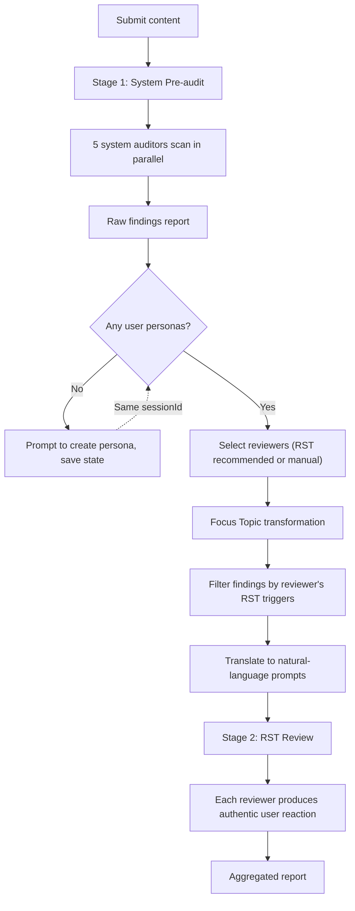
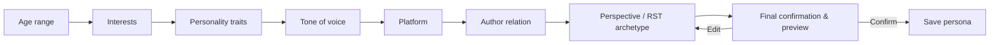
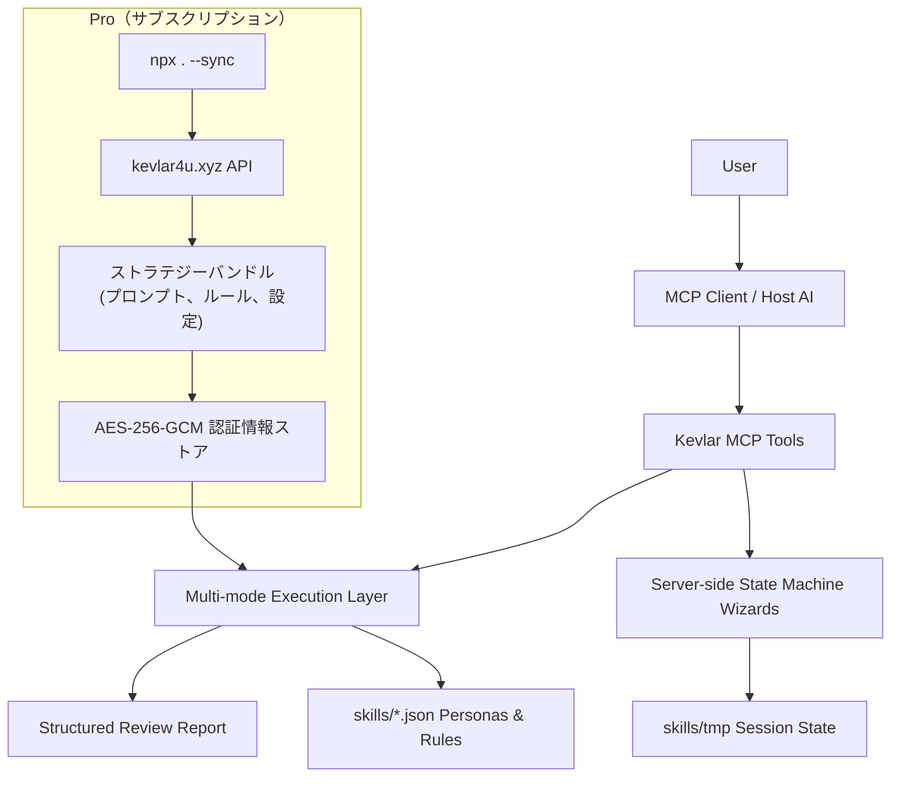

# Kevlar — コメント欄シミュレーター


🌐 [English](../README.md) · [中文](README.zh.md) · [日本語](README.ja.md) · [한국어](README.ko.md)

---

> **カジュアルユーザー、口うるさいネット民、技術層、メディア関係者など、さまざまな立場のリアクションをシミュレーション。公開前に表現の問題、誤解、コミュニケーションリスクを洗い出します。**

---

公開予定のあらゆるコンテンツ — **記事、ツイート、動画スクリプト、プロダクト紹介、プレスリリース、告知、Redditの投稿、V2EXの投稿、Hacker Newsのヘッドライン** — をそのままKevlarに放り込んでください。「いいね」だけを返すツールではありません。実際のインターネットのように、**疑問を投げかけ、誤解し、こき下ろし、細かいツッコミを入れ、理解度をテスト**します。

書き手は往々にして**「知識の呪い」**に苦しみます：
「明確に書いたつもりなのに、相手に伝わらない」
「重要なポイントは強調したはずなのに、読者は何が言いたいのかわからない」

しかも、多くのプラットフォームには本当の意味での**A/Bテスト**はありません。一度公開してしまうと、**最初のオーガニックトラフィックの波**が過ぎ去った頃には、修正するには遅すぎます。

**Kevlarは、公開前にこれらの問題を明らかにします。**

---

## ライセンス & ティアモデル

このリポジトリは **AGPL-3.0** でライセンスされています。**Free**（オープンソース）と **Pro**（サブスクリプション）の両方のクライアントコードを含みます。Pro 機能は有効なライセンスなしでは動作しません。このリポジトリには Pro プロンプト IP やサーバーサイドコードは一切含まれていません。

### 機能比較

| 領域 | Free（そのまま利用可） | Pro（アクティベーションが必要） |
|---|---|---|
| **ペルソナシミュレーション** | 完全な RST ペルソナ作成、自然言語解析、全実行モード | — |
| **システム事前監査** | 6 防御次元 + ローカルルールエンジン（`rules_free.json`） | サーバー同期のストラテジーバンドル：強化プロンプト、実際の事例名、最悪シナリオ |
| **ルールセット** | `rules_free.json`（リポジトリ同梱） | `rules_pro.json` を追加（サーバーから取得） |
| **監査レポート詳細** | 抽象/一般的な説明 | 実際のブランド/イベント名、詳細な増幅チェーン |
| **戦略更新** | リリースにバンドルされた静的デフォルト | サーバーからの動的同期（`npx . --sync`） |
| **プロンプト忠実度** | ロック/プレースホルダー（プロンプト IP 漏洩防止） | SaaS からの完全な Pro 指示 |
| **認証情報と同期** | — | AES-256-GCM 認証情報ストア、Ed25519 バンドル署名検証、失効チェック |
| **カスタムペルソナ保存** | `skills/*.json` による無制限のローカルペルソナ | — |

> **Pro はバックエンドサービス `https://kevlar4u.xyz` によって提供されます。** クライアントはメタデータ（ライセンス ID、バージョン、セッション ID、ロケール）のみを送信し、ユーザーコンテンツ、監査結果、API キーは送信しません。

---

## こんな方におすすめ

**インディーデベロッパー** / **コンテンツクリエイター** / **プロダクトチーム** / **PRチーム** / X、Reddit、V2EX、Hacker Newsをよく利用する方 / コンテンツの質とリーチを向上させたいすべての方

---

## コア機能

### 1. 高度にカスタマイズ可能なレビュアー（ペルソナカスタマイズ）— Free

単一のAI視点からの脱却を、包括的なペルソナカスタマイズで実現：

- **コア属性**：年齢、興味関心、性格、口調。
- **RST（リアクションシミュレーションタクソノミー）**：4層インターネット反応シミュレーション — アーキタイプ（例：「アンチマーケティング検出器」）、コンテンツ感度トリガー、地域文化コンテキスト、プラットフォーム文化を選択。レビュアーの評価ではなく、実際のインターネットユーザーの反応パターンをシミュレーション。
- **認知と関係性**：盲点（例：特定ドメインに対するバイアス）や、作者との社会的関係（例：厳しいメンター、過激な反対者）を定義。
- **自然言語作成**：自然言語で理想のレビュアーを記述（例：「HNのバズワードが嫌いな皮肉屋ユーザー」）、システムが自動的に完全なRST設定にパース。

### 2. 2段階レビューパイプライン

- **Stage 1 — システムプレ監査**（Free: ローカルルール; Pro: サーバー強化）：6つの専門システム監査人がコンプライアンス、コンテキスト歪み、ネットワーク文化リスク、事実誤り、社会的リスク、言語間歪みを並列スキャンし、構造化された発見レポートを生成。
- **Stage 2 — RSTレビュー**（Free）：RST人格を持つユーザー作成レビュアーが**フォーカストピック**（プレ監査の発見をフィルタリング+翻訳）を受け取り、次元スコアリングレポートではなく、本物のユーザーリアクションを生成。

---

## クイックスタート

**Node.js 20+** が必要です。

```bash
npm install           # 依存関係をインストール
npm run build         # TypeScript をコンパイル
npm run setup         # ゼロコンフィグセットアップ（MCPクライアントを自動検出して設定を書き込み）
npm run kevlar-4u    # インタラクティブインストールCLI（クライアントを手動選択）
```

インストール後、AIクライアントを再起動すればKevlarを使い始められます。以下のクライアントを自動設定に対応：

**Claude Desktop** / **Cursor** / **Windsurf** / **OpenCode** / **Codex** / **Antigravity** / **CodeBuddy CN** / **WorkBuddy**

ローカル開発：

```bash
npm run dev
```

本番起動：

```bash
npm start
```

### Pro アクティベーション

```bash
npx . --activate --code <アクティベーションコード>    # コードをライセンスに交換
npx . --sync                                          # サーバーからストラテジーバンドルを同期
npx . --status                                        # Free/Pro ステータスを表示
npx . --doctor                                        # 診断を実行
```

アクティベーションコードは 1 回限り、時間制限あり（10～30 分）。アクティベーション後、クライアントは AES-256-GCM で認証情報を安全に保存し、`kevlar4u.xyz` からストラテジーバンドルを同期します。`--status` で現在のティアを表示、`--sync` で署名検証付きの最新 Pro バンドルをダウンロードします。

---

## 使い方ガイド

### コアワークフロー

Kevlarのすべての主要操作は Wizard ツールを通じて行います — AIに対して自然言語でやりたいことを伝えるだけで、Kevlarがすべてを処理します。

### 推奨ツールフロー

| Wizardツール | 目的 | 主要な動作 |
| --- | --- | --- |
| `review_content_wizard` | コンテンツをレビュー | コンテンツ提出 → レビュアー選択 → 確認 → 多次元フィードバック |
| `create_persona_wizard` | ペルソナを作成 | キャラクターを説明 → AIがフィールドを抽出 → 最終確認 → ペルソナ保存 |
| `delete_persona_wizard` | ペルソナを削除 | 対象を選択 → `confirm delete {ペルソナ名}` と返信 → 完了 |
| `configure_wizard` | 設定を変更 | 変更内容をプレビュー → `confirm config changes` と返信 → 書き込み |

低レベルの直接ツール（自動化スクリプト向け）：

| ツール | 目的 |
| --- | --- |
| `create_persona` | ペルソナを直接、または下書きから作成 |
| `delete_persona` | ペルソナを直接削除（`confirm: true` が必要） |
| `configure` | 設定を直接書き込み |
| `get_execution_modes` | 現在のモードと利用可能性を確認 |
| `list_personas` | ローカルのペルソナ一覧を表示 |
| `kevlar_help` | ヘルプを表示 |

### コンテンツレビューフロー

`review_content_wizard` は「プレ監査、レビュアー選択、フォーカストピック変換、RSTレビュー」を安定したフローとして連結します。



### レビュアーペルソナの作成

`create_persona_wizard` はRSTサポート付きでペルソナ作成をガイドします。



従来の視点プリセット（9択）または**RSTアーキタイプ**（8択）を選択できます。RSTアーキタイプはトリガー、リージョナルコンテキスト、プラットフォーム文化を自動設定します。自然言語で理想のレビュアーを記述（例：「HNのバズワードが嫌いな皮肉屋ユーザー」）し、システムが完全なRST設定にパースすることもできます。

作成後、Kevlarは文化的背景、盲点、行動ヒントを自動的に推論し、対応するプラットフォームの `skills/*.json` に保存します。

---

## 実行モード

Kevlarは3つの実行モードをサポートしています。デフォルトの `auto` は環境に基づいて最適なモードを選択します。

| モード | 識別子 | 説明 | 最適な用途 |
| --- | --- | --- | --- |
| MCP Sampling | `mcp_sampling` | 各レビュアーに独立したサンプリングリクエスト、最大分離 | Sampling対応クライアント、本格的な多視点レビューが必要な場合 |
| Direct API | `direct_api` | 外部モデルAPIを直接呼び出し | Sampling非対応クライアント、またはスクリプト自動化 |
| Orchestration（ホスト補助フォールバック） | `orchestration` | ホストAIが補完、低分離のフォールバック | SamplingもAPI Keyも利用できない場合の最終手段 |

`auto` モードの解決順序：

1. `skills/kevlar-config.json` で指定されたモードを使用（設定されている場合）
2. なければ `KEVLAR_MODE` 環境変数を読み取り
3. なければ利用可能性に応じて自動選択：`mcp_sampling` → `direct_api` → `orchestration`

---

## 設定

### 実行時設定

`configure_wizard` を使って実行時の設定を変更できます。設定は `skills/kevlar-config.json` に書き込まれます（ローカルのみ、リポジトリにはコミットされません）。

```json
{
  "mode": "auto",
  "multiAgent": {
    "maxConcurrency": 3
  }
}
```

### 環境変数

| 変数 | デフォルト値 | 説明 |
| --- | --- | --- |
| `KEVLAR_MODE` | `auto` | `auto`, `orchestration`, `mcp_sampling`, `direct_api` |
| `KEVLAR_MAX_CONCURRENT` | `3` | 最大同時レビュアー数 |
| `KEVLAR_TOKEN_BUDGET_PER_TASK` | `50000` | レビュータスクあたりのトークン予算 |
| `KEVLAR_MIN_DELAY_MS` | `1000` | リクエスト間の最小遅延 |
| `KEVLAR_SKILLS_DIR` | `<repo>/skills` | カスタムペルソナと設定ディレクトリ |
| `KEVLAR_API_KEY` | — | 優先Direct APIキー |
| `ANTHROPIC_API_KEY` | — | Anthropic APIキー |
| `OPENAI_API_KEY` | — | OpenAI APIキー |
| `LOG_LEVEL` | `info` | `debug`, `info`, `warn`, `error` |

> APIキーは環境変数からのみ読み取られます — 設定ファイルに書き込まれることは決してありません。

### MCPクライアントの手動設定

Claude Desktopの例：

```json
{
  "mcpServers": {
    "kevlar-4u": {
      "command": "node",
      "args": ["/ABSOLUTE/PATH/TO/kevlar-4u/dist/index.js"],
      "env": {
        "KEVLAR_MODE": "auto",
        "KEVLAR_MAX_CONCURRENT": "3"
      }
    }
  }
}
```

カスタムペルソナディレクトリ：

```json
{
  "env": {
    "KEVLAR_SKILLS_DIR": "/ABSOLUTE/PATH/TO/skills"
  }
}
```

---

## セキュリティ境界

- `sessionId` は `[a-z0-9-]` のみ許可。
- ペルソナの書き込み・削除操作は、パスバリデーションにより `skills/` ディレクトリ内に制限。
- 実行中の下書きやウィザード状態は `skills/tmp/` に保存され、起動時に期限切れの下書きはクリーンアップ。
- ペルソナ削除には対象の選択と完全な確認フレーズの返信が必要。
- 設定変更は確認前にプレビューが必須。
- APIキーはツールパラメータ経由で渡されたり、ローカル設定に書き込まれることはありません。
- `orchestration` 以外のモードではレビューロックを使用し、複数の外部モデルタスク間のリソース競合を防止。

---

## アーキテクチャ概要

Kevlarは**サーバーサイドワークフロー＋実行レイヤー**アーキテクチャを採用しています。



**Free** 機能（ペルソナ作成、RST レビュー、ローカルルールエンジン、全実行モード）は完全にオフラインで動作します。**Pro** はサーバー同期のストラテジーバンドル（強化プロンプト、実際の事例名、追加ルールセット）を追加します。`npx . --activate` でアクティベートし、`npx . --sync` で同期します。

設計原則：

- **ステートマシン駆動のワークフロー**：主要フローはツールのステートマシンによって維持され、ホストAIが長いプロンプトを記憶することに依存しない。
- **AIが理解と表現を担当**：AIは自然言語の抽出、洗練、レコメンデーションを処理し、結果はKevlarが検証可能な状態に書き込まれる。
- **適応的実行**：MCP Samplingが利用可能な場合はフィールド抽出とレビュアーレコメンデーションに使用し、そうでなければヒューリスティックロジックまたはホスト補助のオーケストレーションにフォールバック。
- **安全な確認**：削除、リセット、設定書き込みなどの高リスク操作は、すべて確認ウィザードを通過する。

### ディレクトリ構造

```text
kevlar/
├── config/
│   └── mcp-config.json                    # MCP client config template
├── docs/                                  # Architecture decisions, ADRs, audit reports
├── schedule/                              # RST design docs & phase logs
│   ├── RST-ARCHITECTURE.md                # RST four-layer architecture
│   ├── RST-需求文档.md                     # RST requirements
│   └── RST-PHASE-LOG.md                   # RST implementation phase log
├── scripts/                               # Install & config scripts
│   ├── cli.ts                             # Interactive install CLI
│   ├── credentialCli.ts                   # Pro: activation, license, sync CLI
│   ├── registry.ts                        # MCP client detection
│   └── setup.ts                           # Zero-config setup script
├── skills/                                # Reviewer persona library
│   ├── auditors.json                      # System auditors
│   ├── xiaohongshu.json                   # Platform: 小红書
│   ├── zhihu.json                         # Platform: 知乎
│   ├── wechat_official.json               # Platform: WeChat公式アカウント
│   ├── rules.json                         # Semantic risk rules (DAO layer)
│   ├── _template.md                       # (Legacy) Persona reference template
│   └── tmp/                               # Runtime wizard session state
├── src/
│   ├── index.ts                           # stdio server entry
│   ├── server.ts                          # MCP server, DI, tool registration
│   ├── __tests__/                         # Test suite
│   ├── execution/                         # Multi-mode execution layer
│   │   ├── index.ts                       # Execution entry, mode resolution
│   │   ├── base.ts                        # Type definitions & interfaces
│   │   ├── client.ts                      # Client capability detection
│   │   ├── config.ts                      # Config read/write
│   │   ├── aggregator.ts                  # Review report aggregation
│   │   ├── limiter.ts                     # Concurrency limiting & retry
│   │   ├── lock.ts                        # Review lock
│   │   ├── parallel.ts                    # Shared parallel execution + RST prompt builder
│   │   ├── dimensions.ts                  # Review dimensions + RST four-layer definitions
│   │   ├── focusTopicTransform.ts         # Focus Topic filter + translate pipeline
│   │   ├── rstParser.ts                   # Natural language → RST config parser
│   │   ├── rstRecommender.ts              # RST-based persona recommendation engine
│   │   ├── strategy.ts                    # Pro: strategy plan types
│   │   ├── strategyBundle.ts              # Pro: bundle signature & verification
│   │   ├── bundleStrategyProvider.ts      # Pro: server-backed strategy provider
│   │   ├── proRuntime.ts                  # Pro: runtime loader
│   │   ├── reviewSteps.ts                 # Pro: step type system & execution
│   │   └── modes/
│   │       ├── orchestration.ts
│   │       ├── sampling.ts
│   │       └── direct_api.ts
│   ├── credential/                        # Pro: activation, license, sync, bundle cache
│   │   ├── index.ts                       # AES-256-GCM credential store
│   │   ├── activate.ts                    # Activation code → license
│   │   ├── activationClient.ts            # Full activation flow
│   │   ├── bundleCache.ts                 # Bundle cache read/write/status
│   │   ├── syncClient.ts                  # Sync strategy bundle from server
│   │   └── store.ts                       # Disk-backed secure credential store
│   ├── subscription/                      # Pro: SaaS-prompt integration
│   │   ├── tier.ts                        # isPro() resolution
│   │   ├── promptTypes.ts                 # PromptSegments type & defaults
│   │   └── promptTemplates.ts             # Prompt text for Pro/Free tiers
│   ├── tools/                             # MCP tools
│   │   ├── index.ts                       # Tool registry
│   │   ├── listPersonasTool.ts
│   │   ├── createPersonaTool.ts           # Create persona + draft management
│   │   ├── createPersonaWizardTool.ts     # Wizard with RST archetype selection
│   │   ├── deletePersonaTool.ts
│   │   ├── deletePersonaWizardTool.ts
│   │   ├── reviewTool.ts
│   │   ├── reviewContentWizardTool.ts
│   │   ├── configureTool.ts
│   │   ├── configureWizardTool.ts
│   │   ├── getModesTool.ts
│   │   └── helpTool.ts
│   ├── dao/                               # Data Access Layer
│   │   ├── IRuleRepository.ts             # Rule repository interface
│   │   ├── LocalJsonRuleRepository.ts     # Local JSON implementation
│   │   ├── index.ts                       # DAO entry point
│   │   └── types.ts                       # Rule data types
│   ├── prompts/
│   │   └── reviewDispatcherPrompt.ts      # Internal design reference
│   └── utils/
│       ├── errors.ts                      # Error codes & formatting
│       ├── logger.ts                      # Structured logging
│       ├── parser.ts                      # Multi-file JSON persona parsing & writing
│       ├── sanitize.ts                    # Credential scanning, prompt boundary handling
│       └── ...
└── package.json
```

---

## データストレージ

### ペルソナ

ペルソナは**マルチファイル JSON** 形式で `skills/` 以下に保存されます。各ファイルには `version`、`last_updated`、`personas` マップが含まれます：

```json
{
  "version": "1.0.0",
  "last_updated": "2026-05-28",
  "personas": {
    "analytical_zhihu": {
      "meta": {
        "id": "analytical_zhihu",
        "name": "理性知乎人",
        "tags": ["知乎", "理性分析"],
        "tone": ["专业", "严谨"],
        "dimensionBias": {
          "entries": [
            { "dimension": "information_gap", "weight": "focus" },
            { "dimension": "differentiation", "weight": "focus" }
          ]
        },
        "rst": {
          "archetypes": ["technical_reviewer"],
          "triggers": ["ai_writing", "overhyped", "data_credibility"],
          "regionalPack": "china",
          "platformCulture": "zhihu"
        }
      },
      "systemPrompt": "あなたは知乎で活発に活動するユーザーです..."
    }
  }
}
```

ファイルはタグによって自動ルーティングされます：

| タグ | 対象ファイル | 用途 |
| --- | --- | --- |
| `system_auditor` | `auditors.json` | システム監査人 |
| `"小红书"` | `xiaohongshu.json` | プラットフォーム別ユーザーペルソナ |
| `"知乎"` | `zhihu.json` | プラットフォーム別ユーザーペルソナ |
| *(不明)* | `fallback.json` | 未認識プラットフォームのキャッチオール |

新しいペルソナファイルは起動時にコンテンツスニッフィング（`personas` キーの存在）により自動検出されます。新しいプラットフォームの追加は `skills/` に JSON ファイルを配置するだけで完了します。

### ルール

意味的リスクルールは `skills/rules.json` に保存され、DAO レイヤー（`src/dao/`）を通じてアクセスされます：

```json
{
  "version": "1.0.0",
  "categories": {
    "food": {
      "enabled": true,
      "associative_map": [
        {
          "root": "不新鲜",
          "variants": ["食材不新鲜", "东西不新鲜"],
          "misinterpret_direction": "食品安全問題と誤解される可能性あり",
          "severity": "medium"
        }
      ]
    }
  }
}
```

### ペルソナの作成

`create_persona_wizard` ツールを使用してください — 年齢、興味、性格、口調、プラットフォーム、作者との関係、**RSTアーキタイプ選択**を段階的にガイドします。自然言語で理想のレビュアーを記述（例：「HNのバズワードが嫌いな皮肉屋ユーザー」）すると、システムが自動的に完全なRST設定にパースします。ペルソナは自動的に正しいプラットフォーム JSON ファイルに保存されます。手動でのファイル編集は不要です。

---

## リリース前チェックリスト

```bash
npm run build
npm test
```

リリース前には、[docs/PRE_RELEASE_AUDIT_REQUEST.md](PRE_RELEASE_AUDIT_REQUEST.md) をローカルAIに渡して独立した監査を依頼することを推奨します。
