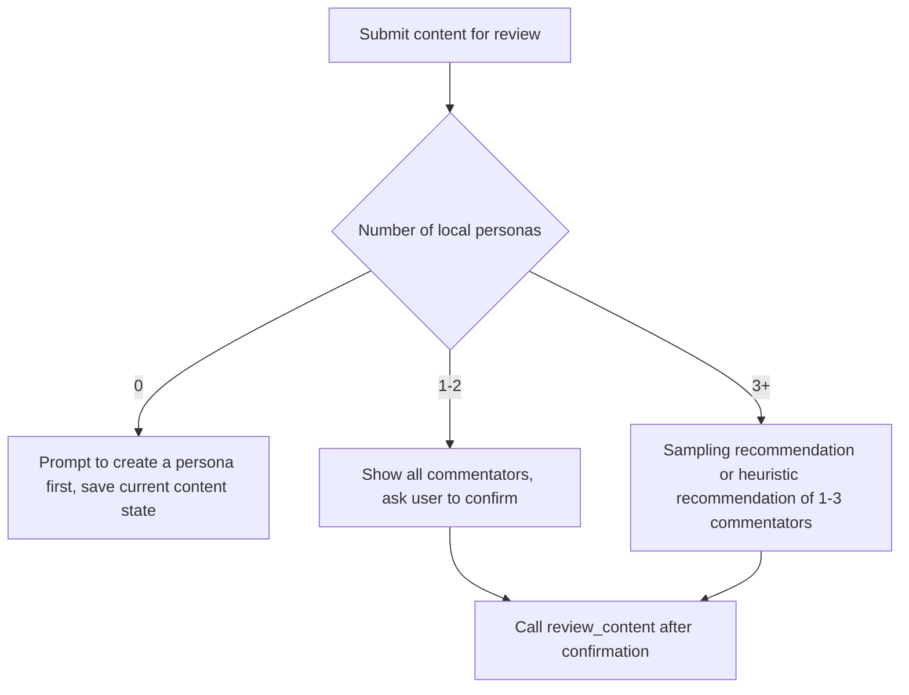
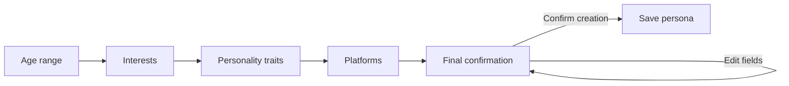
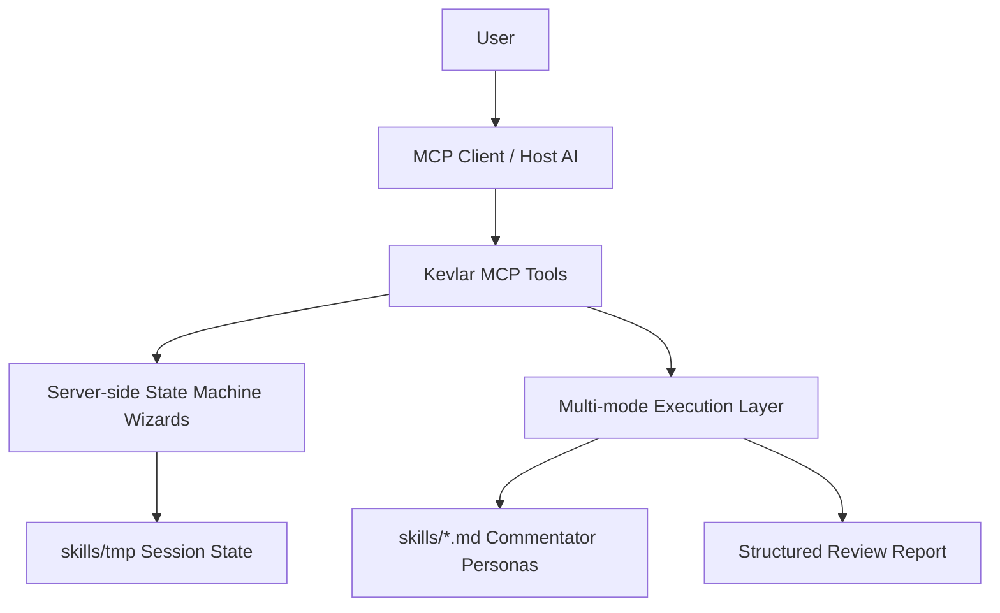

# Kevlar — 公開前フィードバックシミュレーター


🌐 [English](../README.md) · [中文](README.zh.md) · [日本語](README.ja.md) · [한국어](README.ko.md)

---

> **カジュアルユーザー、口うるさいネット民、技術層、メディア関係者など、さまざまな立場のリアクションをシミュレーション。公開前に表現の問題、誤解、コミュニケーションリスクを洗い出します。**

---

公開予定のあらゆるコンテンツ — **記事、ツイート、動画スクリプト、プロダクト紹介、プレスリリース、告知、Redditの投稿、V2EXの投稿、Hacker Newsのヘッドライン** — をそのままKevlarに放り込んでください。「いいね」だけを返すツールではありません。実際のインターネットのように、**疑問を投げかけ、誤解し、こき下ろし、細かいツッコミを入れ、理解度をテスト**します。

書き手は往々にして**「知識の呪い」**に苦しみます：
「明確に書いたつもりなのに、相手に伝わらない」
「重要なポイントは強調したはずなのに、読者は何が言いたいのかわからない」

しかも、多くのプラットフォームには本当の意味での**A/Bテスト**はありません。一度公開してしまうと、**最初のオーガニックトラフィックの波**が過ぎ去った頃には、修正するには遅すぎます。

**Kevlarは、公開前にこれらの問題を明らかにします。**

## こんな方におすすめ

**インディーデベロッパー** / **コンテンツクリエイター** / **プロダクトチーム** / **PRチーム** / X、Reddit、V2EX、Hacker Newsをよく利用する方 / コンテンツの質とリーチを向上させたいすべての方

---

## コア機能

### 1. 高度にカスタマイズ可能な仮想コメンテーター（ペルソナカスタマイズ）

単一のAI視点からの脱却を、包括的なペルソナカスタマイズで実現：

- **コア属性**：年齢、興味関心、性格、立場。
- **認知と関係性**：盲点（例：特定ドメインに対するバイアス）や、作者との社会的関係（例：厳しいメンター、過激な反対者）を定義。
- **文化適応**：入力コンテンツの言語を自動検出し、それにマッチしたローカライズされた文化的コンテキストを推論。

### 2. 完全自動化フィードバックパイプライン

- **スマートディスパッチ**：作成した作品を貼り付けると、AIディスパッチャーが自動的にコンテンツの特性を分析。
- **精密マッチング**：最も関連性の高い仮想コメンテーターを動的にフィルタリングしてスケジューリング。
- **多次元的衝突**：多様な立場や専門的な視点から、差別化されたコメントとフィードバックを生成。

---

## クイックスタート

**Node.js 20+** が必要です。

```bash
npm install           # 依存関係をインストール
npm run build         # TypeScript をコンパイル
npm run setup         # ゼロコンフィグセットアップ（MCPクライアントを自動検出して設定を書き込み）
npm run kevlar-mcp    # インタラクティブインストールCLI（クライアントを手動選択）
```

インストール後、AIクライアントを再起動すればKevlarを使い始められます。以下のクライアントを自動設定に対応：

**Claude Desktop** / **Cursor** / **Windsurf** / **OpenCode** / **Codex** / **Antigravity** / **CodeBuddy CN** / **WorkBuddy**

ローカル開発：

```bash
npm run dev
```

本番起動：

```bash
npm start
```

---

## 使い方ガイド

### コアワークフロー

Kevlarのすべての主要操作は Wizard ツールを通じて行います — AIに対して自然言語でやりたいことを伝えるだけで、Kevlarがすべてを処理します。

### 推奨ツールフロー

| Wizardツール | 目的 | 主要な動作 |
| --- | --- | --- |
| `review_content_wizard` | コンテンツをレビュー | コンテンツ提出 → コメンテーター選択 → 確認 → 多次元フィードバック |
| `create_persona_wizard` | ペルソナを作成 | キャラクターを説明 → AIがフィールドを抽出 → 最終確認 → ペルソナ保存 |
| `delete_persona_wizard` | ペルソナを削除 | 対象を選択 → `confirm delete {ペルソナ名}` と返信 → 完了 |
| `configure_wizard` | 設定を変更 | 変更内容をプレビュー → `confirm config changes` と返信 → 書き込み |

低レベルの直接ツール（自動化スクリプト向け）：

| ツール | 目的 |
| --- | --- |
| `review_content` | 直接コンテンツレビューを実行 |
| `create_persona` | ペルソナを直接、または下書きから作成 |
| `delete_persona` | ペルソナを直接削除（`confirm: true` が必要） |
| `configure` | 設定を直接書き込み |
| `get_execution_modes` | 現在のモードと利用可能性を確認 |
| `list_personas` | ローカルのペルソナ一覧を表示 |
| `kevlar_help` | ヘルプを表示 |

### コンテンツレビューフロー

`review_content_wizard` は「コンテンツ保存、コメンテーター選択、実行確認」を安定したフローとして連結します。



### コメンテーターペルソナの作成

`create_persona_wizard` はペルソナ作成をステップバイステップでガイドします。



作成後、Kevlarは自動的に文化的背景、作者との関係、立場、盲点を推論し、`skills/*.md` に保存します。

---

## 実行モード

Kevlarは3つの実行モードをサポートしています。デフォルトの `auto` は環境に基づいて最適なモードを選択します。

| モード | 識別子 | 説明 | 最適な用途 |
| --- | --- | --- | --- |
| MCP Sampling | `mcp_sampling` | 各コメンテーターに独立したサンプリングリクエスト、最大分離 | Sampling対応クライアント、本格的な多視点レビューが必要な場合 |
| Direct API | `direct_api` | 外部モデルAPIを直接呼び出し | Sampling非対応クライアント、またはスクリプト自動化 |
| Orchestration（ホスト補助フォールバック） | `orchestration` | ホストAIが補完、低分離のフォールバック | SamplingもAPI Keyも利用できない場合の最終手段 |

`auto` モードの解決順序：

1. `skills/kevlar-config.json` で指定されたモードを使用（設定されている場合）
2. なければ `KEVLAR_MODE` 環境変数を読み取り
3. なければ利用可能性に応じて自動選択：`mcp_sampling` → `direct_api` → `orchestration`

---

## 設定

### 実行時設定

`configure_wizard` を使って実行時の設定を変更できます。設定は `skills/kevlar-config.json` に書き込まれます（ローカルのみ、リポジトリにはコミットされません）。

```json
{
  "mode": "auto",
  "multiAgent": {
    "maxConcurrency": 3
  }
}
```

### 環境変数

| 変数 | デフォルト値 | 説明 |
| --- | --- | --- |
| `KEVLAR_MODE` | `auto` | `auto`, `orchestration`, `mcp_sampling`, `direct_api` |
| `KEVLAR_MAX_CONCURRENT` | `3` | 最大同時コメンテーター数 |
| `KEVLAR_TOKEN_BUDGET_PER_TASK` | `50000` | レビュータスクあたりのトークン予算 |
| `KEVLAR_MIN_DELAY_MS` | `1000` | リクエスト間の最小遅延 |
| `KEVLAR_SKILLS_DIR` | `<repo>/skills` | カスタムペルソナと設定ディレクトリ |
| `KEVLAR_API_KEY` | — | 優先Direct APIキー |
| `ANTHROPIC_API_KEY` | — | Anthropic APIキー |
| `OPENAI_API_KEY` | — | OpenAI APIキー |
| `LOG_LEVEL` | `info` | `debug`, `info`, `warn`, `error` |

> APIキーは環境変数からのみ読み取られます — 設定ファイルに書き込まれることは決してありません。

### MCPクライアントの手動設定

Claude Desktopの例：

```json
{
  "mcpServers": {
    "kevlar": {
      "command": "node",
      "args": ["/ABSOLUTE/PATH/TO/kevlar/dist/index.js"],
      "env": {
        "KEVLAR_MODE": "auto",
        "KEVLAR_MAX_CONCURRENT": "3"
      }
    }
  }
}
```

カスタムペルソナディレクトリ：

```json
{
  "env": {
    "KEVLAR_SKILLS_DIR": "/ABSOLUTE/PATH/TO/skills"
  }
}
```

---

## セキュリティ境界

- `sessionId` は `[a-z0-9-]` のみ許可。
- ペルソナの書き込み・削除操作は、パスバリデーションにより `skills/` ディレクトリ内に制限。
- 実行中の下書きやウィザード状態は `skills/tmp/` に保存され、起動時に期限切れの下書きはクリーンアップ。
- ペルソナ削除には対象の選択と完全な確認フレーズの返信が必要。
- 設定変更は確認前にプレビューが必須。
- APIキーはツールパラメータ経由で渡されたり、ローカル設定に書き込まれることはありません。
- `orchestration` 以外のモードではレビューロックを使用し、複数の外部モデルタスク間のリソース競合を防止。

---

## アーキテクチャ概要

Kevlarは**サーバーサイドワークフロー＋実行レイヤー**アーキテクチャを採用しています。



設計原則：

- **ステートマシン駆動のワークフロー**：主要フローはツールのステートマシンによって維持され、ホストAIが長いプロンプトを記憶することに依存しない。
- **AIが理解と表現を担当**：AIは自然言語の抽出、洗練、レコメンデーションを処理し、結果はKevlarが検証可能な状態に書き込まれる。
- **適応的実行**：MCP Samplingが利用可能な場合はフィールド抽出とコメンテーターレコメンデーションに使用し、そうでなければヒューリスティックロジックまたはホスト補助のオーケストレーションにフォールバック。
- **安全な確認**：削除、リセット、設定書き込みなどの高リスク操作は、すべて確認ウィザードを通過する。

### ディレクトリ構造

```text
kevlar/
├── config/
│   └── mcp-config.json                    # MCP client config template
├── docs/                                  # Architecture design, audit reports
├── scripts/                               # Install & config scripts
│   ├── cli.ts                             # Interactive install CLI
│   ├── registry.ts                        # MCP client detection
│   └── setup.ts                           # Zero-config setup script
├── skills/                                # Commentator persona library
│   ├── _template.md                       # Persona template
│   └── tmp/                               # Runtime wizard session state
├── src/
│   ├── index.ts                           # stdio server entry
│   ├── server.ts                          # MCP server, DI, tool registration
│   ├── __tests__/                         # Test suite
│   ├── execution/                         # Multi-mode execution layer
│   │   ├── index.ts                       # Execution entry, mode resolution
│   │   ├── base.ts                        # Type definitions & interfaces
│   │   ├── client.ts                      # Client capability detection
│   │   ├── config.ts                      # Config read/write
│   │   ├── aggregator.ts                  # Review report aggregation
│   │   ├── limiter.ts                     # Concurrency limiting & retry
│   │   ├── lock.ts                        # Review lock
│   │   ├── parallel.ts                    # Shared parallel execution
│   │   └── modes/
│   │       ├── orchestration.ts
│   │       ├── sampling.ts
│   │       └── direct_api.ts
│   ├── tools/                             # MCP tools
│   │   ├── index.ts                       # Tool registry
│   │   ├── listPersonasTool.ts
│   │   ├── createPersonaTool.ts           # Create persona + draft management
│   │   ├── createPersonaWizardTool.ts
│   │   ├── deletePersonaTool.ts
│   │   ├── deletePersonaWizardTool.ts
│   │   ├── reviewTool.ts
│   │   ├── reviewContentWizardTool.ts
│   │   ├── configureTool.ts
│   │   ├── configureWizardTool.ts
│   │   ├── getModesTool.ts
│   │   └── helpTool.ts
│   ├── prompts/
│   │   └── reviewDispatcherPrompt.ts      # Internal design reference
│   └── utils/
│       ├── errors.ts                      # Error codes & formatting
│       ├── logger.ts                      # Structured logging
│       ├── parser.ts                      # Persona file parsing & writing
│       ├── sanitize.ts                    # Credential scanning, prompt boundary handling
│       └── ...
└── package.json
```

---

## コメンテーターペルソナのコントリビュート

`skills/` 以下にプラットフォームごとにサブディレクトリと `.md` ファイルを追加するか、`skills/` 直下に配置してください。カスタムペルソナファイルはデフォルトで `.gitignore` により除外され、リポジトリにコミットされません。

テンプレート `skills/_template.md` を参照：

```markdown
---
id: your_persona_id
name: Display name
description: One-line description of what this commentator focuses on
tags:
  - Platform
  - Interest
author: custom
---

Age range:
Interests:
Platforms:
Personality traits:
- Trait → Behavior

Cultural background:
Relationship with author:
Stance:
Blind spots:
```

カスタムペルソナはレビューに参加する前にフィールドの完全性バリデーションを受けます。最低でも、プラットフォーム、性格特性、盲点などの情報がパース可能であるか、descriptionに含まれている必要があります。

---

## リリース前チェックリスト

```bash
npm run build
npm test
```

リリース前には、[docs/PRE_RELEASE_AUDIT_REQUEST.md](docs/PRE_RELEASE_AUDIT_REQUEST.md) をローカルAIに渡して独立した監査を依頼することを推奨します。
