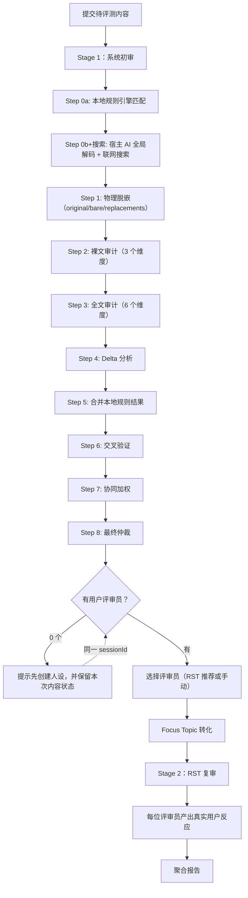
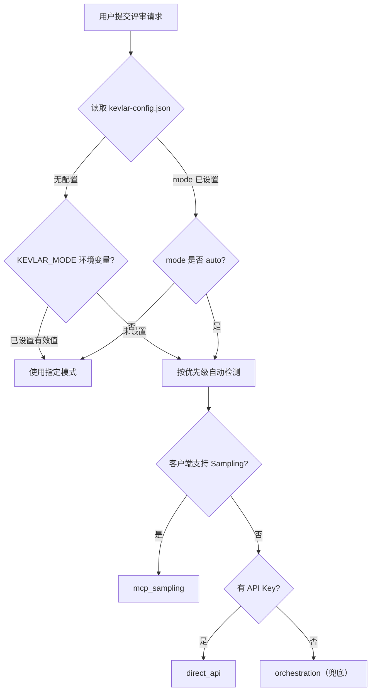
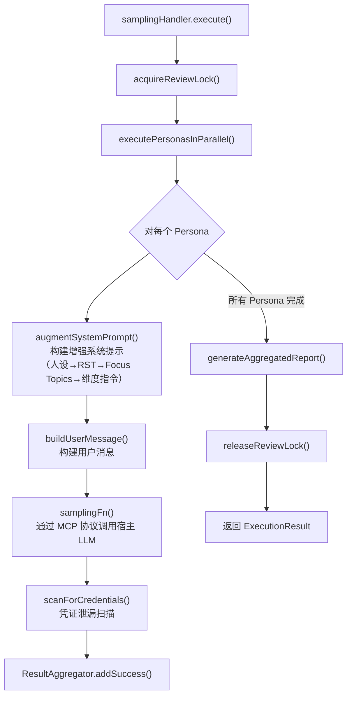
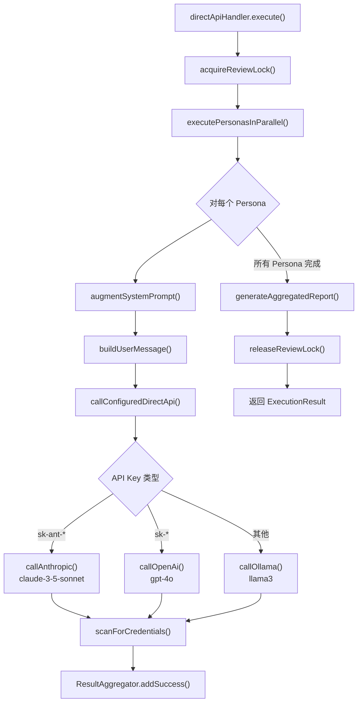
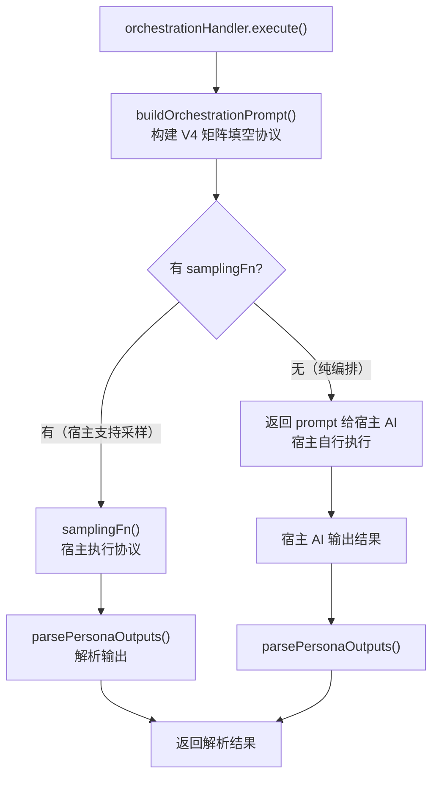
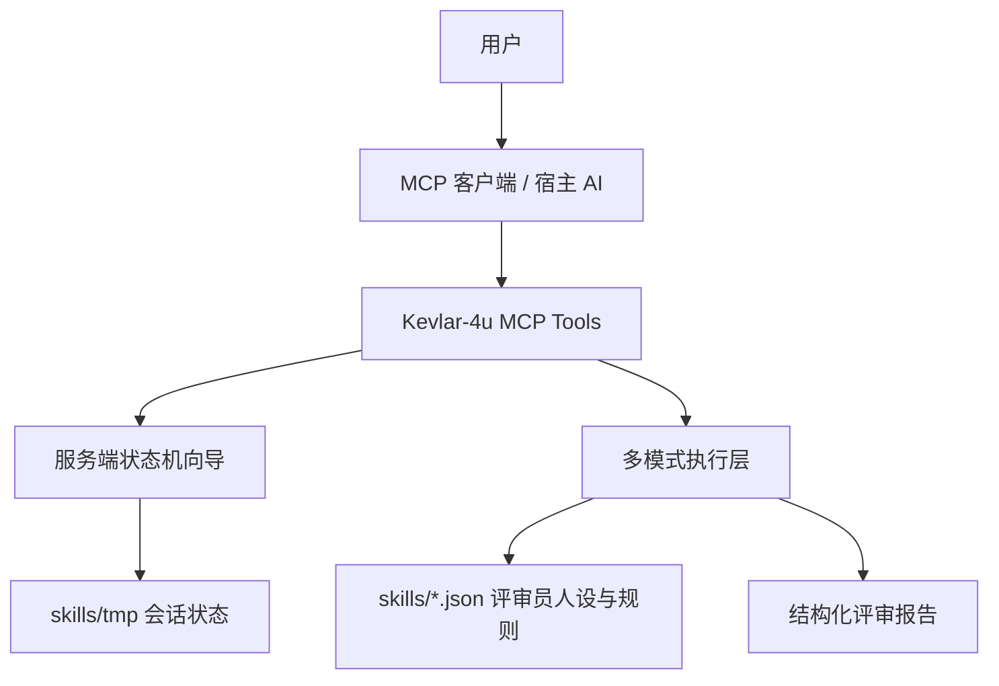

# Kevlar-4u — 社交媒体作品发布前的反馈模拟器


🌐 [English](../README.md) · [中文](README.zh.md) · [日本語](README.ja.md) · [한국어](README.ko.md)

---

> **它会模拟普通用户、挑剔网友、技术用户、媒体视角等不同人群的真实反应，帮你提前发现表达问题、误解点与传播风险。**

---

你可以把准备发布的内容——**文章、推文、视频脚本、产品介绍、新闻稿、公告、Reddit 帖子、V2EX 帖子、Hacker News 标题**——直接丢给 Kevlar-4u。它不会只告诉你"写得不错"，而是像真实互联网一样，对内容进行**质疑、误解、吐槽、挑刺与理解测试**。

很多时候，作者已经陷入**"当局者迷"**：
你以为讲清楚了，但别人根本没看懂；
你以为重点很突出，但用户甚至不知道你到底想表达什么。

而大多数平台几乎不给真正的 **A/B 测试**机会。内容一旦发出去，**第一波自然流量**过去后，再修改往往已经太晚。

**Kevlar-4u 的作用，就是帮你在正式发布前，提前暴露这些问题。**

---

## 许可协议

Kevlar-4u 的核心本地功能以 **AGPL-3.0** 协议开源。

云端风险词云服务、付费规则同步及高级功能属于**商业闭源服务**。

---

## 谁会需要 Kevlar

**独立开发者** / **自媒体创作者** / **产品团队** / **PR 团队** / 经常发 X、Reddit、V2EX、Hacker News 的用户 / 想提升内容表达与传播效果的人

---

## 核心特性

### 1. 高度定制的评审员（Persona Customization）

打破单一的 AI 视角，支持全方位的评审员画像定制：

- **核心属性**：年龄、兴趣、性格、讲话语气。
- **RST（互联网反应模拟人格）**：四层互联网反应模拟——选择人格底色（如"反营销敏感者"）、内容敏感触发器、地区文化过滤器、平台文化层。系统模拟真实互联网用户的反应模式，而非传统评审员的维度打分。
- **认知与关系**：自定义其认知盲区（如特定领域的偏见）以及与作者的社交关系（如严苛的导师、激进的反对者）。
- **自然语言创建**：用自然语言描述你想要的评审员（如"一个讨厌 buzzword 的 HN 毒舌用户"），系统自动解析为完整的 RST 配置。

### 2. 两阶段评审流水线

**Stage 1 — 系统初审**：6 位专业系统审查员对以下六个防御维度进行扫描：

| 审查员 (ID) | 审查焦点 |
|---|---|
| 合规哨兵 (`legal_compliance`) | 广告法违规、虚假宣传、非法建议、侵权、政治红线 |
| 社伦判官 (`social_risk`) | 歧视偏见、刻板印象、道德绑架、语气情绪风险、反向风险 |
| 语境猎手 (`context_distortion`) | 截图脱语境化、断章取义、恶意曲解潜力 |
| 暗语破译 (`network_culture_risk`) | 网络黑话撞车、亚文化用语、隐晦低俗含义 |
| 事实判官 (`factual_integrity`) | 事实错误、常识背离、逻辑漏洞、数据可信度 |
| 跨界判官 (`cross_lingual_distortion`) | 外文恶意机翻、谐音梗、文化水土不服、野生翻译风险 |

当有独立 LLM 调用能力时（MCP Sampling / Direct API），每位审查员以独立 LLM 调用执行，隔离度最高。进入兜底模式（Orchestration）时，使用 **矩阵填空协议** 替代角色扮演——每个维度是一个独立 XML 沙盒槽位，填写完成后由仲裁沙盒交叉验证。详见[协议对比](#协议对比矩阵填空与伪并行与强化角色扮演)。

**Stage 2 — RST 复审**：用户创建的带 RST 人格的评审员接收 **Focus Topics**（根据评审员的 RST Trigger 从初审发现中过滤+转译），产出真实用户反应，而非维度评分报告。

---

## 快速开始

要求 **Node.js 20+**。

```bash
npm install           # 安装依赖
npm run build         # 编译 TypeScript
npm run setup         # 零配置安装（自动检测 MCP 客户端并写入配置）
npm run kevlar-4u    # 交互式安装 CLI（手动选择客户端）
```

安装完成后重启 AI 客户端即可开始使用。支持以下客户端自动配置：

**Claude Desktop** / **Cursor** / **Windsurf** / **OpenCode** / **Codex** / **Antigravity** / **CodeBuddy CN** / **WorkBuddy**

本地开发：

```bash
npm run dev
```

生产启动：

```bash
npm start
```


---

## 使用指南

### 核心流程

Kevlar-4u 的所有核心操作都通过向导工具（Wizard）完成，你只需要用自然语言告诉 AI 你想做什么，剩下的步骤由 Kevlar 自动推进。

### 推荐工具流

| 向导工具 | 用途 | 关键行为 |
| --- | --- | --- |
| `review_content_wizard` | 评审内容 | 提交文案 → 系统初审 → 选择评审员 → Focus Topic 转化 → RST 复审 → 输出多维反馈 |
| `create_persona_wizard` | 创建评审员 | 描述角色 → 填写 6 项属性（年龄/兴趣/特质/语气/平台/关系） → 预览 → 确认 → 保存人设 |
| `delete_persona_wizard` | 删除人设 | 选择目标 → 回复 `确认删除{人设名}` → 完成 |
| `configure_wizard` | 修改配置 | 预览变更 → 回复 `确认修改配置` → 写入 |

底层直调工具（适合自动化脚本）：

| 工具 | 用途 |
| --- | --- |
| `delete_persona` | 直接删除人设（需 `confirm: true`） |
| `configure` | 直接写入配置 |
| `get_modes` | 查看当前模式和可用性 |
| `list_personas` | 列出本地人设 |
| `help` | 查看帮助 |
| `language` | 切换界面语言 |

### 内容评审流程

`review_content_wizard` 负责把"初审、评审员选择、Focus Topic 转化、RST 复审"串成稳定流程。



### 创建评审员人设

`create_persona_wizard` 会引导你逐步完成人设创建，支持 RST 人格配置。


你可以选择传统视角预设（9 个选项）或 **RST 人格**（8 个选项）。RST 人格会自动配置触发器、地区文化、平台文化。你也可以用自然语言描述你想要的评审员（如"一个讨厌营销话术的知乎技术用户"），系统会自动解析为完整的 RST 配置。

创建完成后，Kevlar-4u 会自动推断文化背景、盲区和行为暗示，保存到对应平台的 `skills/*.json`。

---

## 执行模式

Kevlar-4u 支持三种执行模式。默认的 `auto` 模式会根据你的环境自动选择最合适的模式。

### 模式选择流程



### 模式详情

| 模式 | 标识符 | 降级触发条件 | 初审策略 | 复审策略 |
| --- | --- | --- | --- | --- |
| MCP Sampling | `mcp_sampling` | 客户端声明 `sampling` 能力 | 6 个独立 LLM 调用，每维度一个 | 每人设独立 LLM 调用 |
| 直接 API | `direct_api` | 设置了 `KEVLAR_API_KEY` 或 `ANTHROPIC_API_KEY` / `OPENAI_API_KEY` | 6 个独立 LLM 调用，每维度一个 | 每人设独立 LLM 调用 |
| 编排 (兜底) | `orchestration` | 既无 Sampling 又无 API Key | **V4 矩阵填空协议** — 单 prompt 含 6 个 XML 沙盒槽位 | **强化角色扮演** — 顺序执行人设，上下文重置门隔离 |

### MCP Sampling 模式

通过 MCP 协议反向调用宿主 LLM，每个评审员获得独立的 sampling 请求，隔离度最高。



### Direct API 模式

直接调用第三方 LLM API（Anthropic / OpenAI / Ollama），与 Sampling 模式共享并行执行逻辑。



### 宿主编排模式（Orchestration）

无独立 LLM 调用能力时的兜底方案。系统初审使用 V4 矩阵填空协议，复审使用强化角色扮演+上下文重置门。



**系统初审隔离**：使用 V4 矩阵填空协议——一次推理中模型填写结构化的 XML 沙盒槽位（每个防御维度一个），而非扮演独立角色。每个沙盒包含从审查员 `systemPrompt` 提取的维度专用 CoT 检查清单（含跨语言曲解专项推理）。然后 `<arbitration_sandbox>` 交叉验证和过滤噪声。最终输出纯 JSON `{ dimensions: [...] }`，摘要由代码自动生成以确保格式一致性。

**RST 复审隔离**：人设保留角色扮演模式（RST 需要"真实用户"风格的模拟），但每个人设块前插入 **上下文重置门**：`--- 隔离边界：上下文重置点。丢弃上一个审查员的全部推理和结论 ---`。这防止了后续人设软化或重复早期人设的长尾退化问题。

---

## 协议对比：矩阵填空 vs 伪并行 vs 强化角色扮演

V4 矩阵填空协议是为解决系统初审兜底路径中的 **角色漂移 (role drift)** 问题引入的。以下是三种协议的对比：

| 维度 | 伪并行（旧版初审） | 矩阵填空（V4，当前初审兜底） | 强化角色扮演（当前复审兜底） |
|------|-------------------|------------------------|------------------------|
| 核心哲学 | "同时扮演 N 个独立审查员" | "填写结构化槽位 + 事实分析" | "扮演人设，然后重置上下文" |
| 角色漂移风险 | **高** — 审查员之间频繁交叉污染 | **低** — 协议级槽位隔离，无"扮演"语言 | **中** — 重置门缓解但未完全消除 |
| 输出格式 | 自由格式 Markdown | 严格 JSON `{ dimensions: [...] }` | 混合 — JSON 发现给系统审查员，自由文本给 RST 人设 |
| CoT 来源 | 通用（相同模板的 `<cot>`） | 维度专用（从各审查员 `systemPrompt` 提取） | 人设专用（跟随各人设自己的 prompt） |
| 仲裁机制 | prompt 正文中的平面指令列表 | `<arbitration_sandbox>` 含专用 CoT + 输出槽位 | 手动摘要区（宿主 AI 聚合） |
| 修改建议 | 未明确禁止 | **明确禁止**（元规则 + 仲裁步骤双重保障） | 通过 `buildKevlarRiskDirective()` 禁止 |

**为什么不对 RST 复审应用矩阵填空？** RST 人设旨在模拟*真实的用户反应*（"真人上网的第一反应，不是评估报告"）。矩阵填空会压制这些人设所需的情感/创作自由。上下文重置门方案在保留人设表达力的同时提供了大部分隔离收益。

---

## 初审流程详解

系统初审（Stage 1）是一个 10 步流水线，跨两轮交互（Turn 1 + Turn 2）完成。

### 汇总表

| Step | 执行者 | 主要操作 |
|------|--------|----------|
| 0a | 代码 | 本地规则匹配 — 时机节点检测、2-4 gram 滑动窗口、L2 结构模式、Multi-hop patterns → `localFindings[]` |
| 0b+搜索 | 宿主 AI | 职业黑粉逆向全局解码 + 联网搜索 + 类似事件先例检索（合并为宿主 AI 单轮调用）→ `step0Result` + `webContextMap`。DuckDuckGo 依赖已移除 |
| 1 | 代码 | 物理脱嵌 — `stripContext(raw, knownEntities?)` 生成 original、bare（裸文）和 replacements |
| 2 | LLM | 裸文审计 — `context_distortion` + `network_culture_risk` + `cross_lingual_distortion` 三个维度，注入联网上下文 |
| 3 | LLM | 全文审计 — 所有 6 个维度并行，每个维度独立推理，注入联网上下文 |
| 4 | 代码 | Delta 分析 — 内联于 `executeLlmSystemAudit()`，对比 bare vs full 发现，提取脱嵌放大型风险和全文特有风险 |
| 5 | 代码 | 合并 — 本地规则 findings 注入 `network_culture_risk` 维度（纯内存合并，无二次联网） |
| 6 | LLM | 交叉验证 — 跨维度互验（6 对：network↔context, cross_lingual↔network, social→factual, legal→social） |
| 7 | 代码 | 协同加权 — `calculateSynergy(dimensionLevels, extraFlags?)` 检测跨维度组合风险，🟡→🔴 升级判定 |
| 8 | LLM | 最终仲裁 — 合并重复 findings、强化攻击链、生成 worstCaseNarrative，并输出 precedents 供后续参考 |
| 9 | 代码 | 结果展示 — 用户看到初审结果（含 📌 类似先例），选择进入复审或平台合规检查 |

### 核心文件索引

| 步骤 | 文件 | 函数 / 提示词 |
|------|------|--------------|
| Step 0a | `src/tools/reviewContentWizardTool.ts` | `buildLocalRuleFindings()` |
| Step 0b+搜索 | `src/prompts/reviewWizard.ts` | `buildOrchestrationStep0Prompt()`（含联网搜索指令） |
| Step 1 | `src/utils/stripContext.ts` | `stripContext(raw, knownEntities?)` |
| Step 2-3 | `src/tools/reviewContentWizardTool.ts` | `runSystemAuditors()` |
| Step 4 | `src/tools/reviewContentWizardTool.ts` | 内联于 `executeLlmSystemAudit()` |
| Step 5 | `src/tools/reviewContentWizardTool.ts` | `mergeLocalFindingsIntoAudits()` |
| Step 6 | `src/tools/reviewContentWizardTool.ts` | `crossValidateRiskyDimensions()` |
| Step 7 | `src/execution/synergyCalculator.ts` | `calculateSynergy(dimensionLevels, extraFlags?)` |
| Step 8 | `src/tools/reviewContentWizardTool.ts` | `finalizePreAuditReport()` / `buildPreAuditFinalizerPrompt()` |

### 联网验证说明

联网搜索不再由 kevlar 服务器自行调用。Step 0b 与联网搜索**合并**为宿主 AI 的一轮交互：宿主 AI 在执行职业黑粉逆向解码的同时，使用自己的 web search 工具对 blackAtoms 搜索中文网络语境，并基于风险方向检索类似舆情翻车先例，输出 `step0Result` + `webContextMap`。

- **Step 2-3 联网上下文注入**：`runSystemAuditors()` 根据宿主 AI 返回的 `webContextMap`，为每个系统审计员构建 `webContext` 文本并注入审计提示词。
- **Step 5 纯内存合并**：无需发起任何网络请求。
- **DuckDuckGo 依赖已移除**：`src/execution/webSearch.ts` 已删除，`runUnifiedWebSearch()` 已移除。

---

## 配置

### 运行时配置

通过 `configure_wizard` 修改运行偏好，配置写入 `skills/kevlar-config.json`（本地化，不提交到仓库）。

```json
{
  "mode": "auto",
  "multiAgent": {
    "maxConcurrency": 3
  }
}
```

### 环境变量

| 环境变量 | 默认值 | 说明 |
| --- | --- | --- |
| `KEVLAR_MODE` | `auto` | `auto`、`orchestration`、`mcp_sampling`、`direct_api` |
| `KEVLAR_MAX_CONCURRENT` | `3` | 多评审员最大并发数 |
| `KEVLAR_TOKEN_BUDGET_PER_TASK` | `50000` | 单次评审预算上限 |
| `KEVLAR_MIN_DELAY_MS` | `1000` | 请求间最小延迟 |
| `KEVLAR_SKILLS_DIR` | `<repo>/skills` | 自定义人设与配置目录 |
| `KEVLAR_API_KEY` | — | Direct API 首选 Key |
| `ANTHROPIC_API_KEY` | — | Anthropic API Key |
| `OPENAI_API_KEY` | — | OpenAI API Key |
| `KEVLAR_MODEL` | — | 自定义模型名（覆盖默认） |
| `OLLAMA_BASE_URL` | — | Ollama 服务地址 |
| `KEVLAR_ENABLE_SAMPLING` | — | 强制启用 Sampling（覆盖自动检测） |
| `LOG_LEVEL` | `info` | `debug`、`info`、`warn`、`error` |

> API Key 只从环境变量读取，不写入配置文件。

### MCP 客户端手动配置

Claude Desktop 示例：

```json
{
  "mcpServers": {
    "kevlar-4u": {
      "command": "node",
      "args": ["/ABSOLUTE/PATH/TO/kevlar-4u/dist/index.js"],
      "env": {
        "KEVLAR_MODE": "auto",
        "KEVLAR_MAX_CONCURRENT": "3"
      }
    }
  }
}
```

> 如果使用 `npm run kevlar-4u` 安装 CLI 自动配置，脚本会自动探测正确的入口路径。手动配置时注意路径为 `dist/index.js`。

自定义人设目录：

```json
{
  "env": {
    "KEVLAR_SKILLS_DIR": "/ABSOLUTE/PATH/TO/skills"
  }
}
```

---

## 安全边界

- `sessionId` 只允许 `[a-z0-9-]`。
- 人设写入和删除都通过路径校验限制在 `skills/` 内。
- 运行时草稿和向导状态写入 `skills/tmp/`，启动时会清理 24 小时前的过期草稿。
- 删除人设必须绑定目标并回复完整确认语。
- 配置修改必须先预览再确认。
- API Key 不通过工具参数传递，不写入本地配置。
- 非 `orchestration` 执行模式会使用评审锁，避免多个外部模型任务同时竞争资源。

---

## 架构概览

Kevlar-4u 采用 **Server-side Workflow + Execution Layer** 架构。



设计原则：

- **状态机驱动流程**：关键流程由工具状态机维护，不依赖宿主 AI 记住长提示词。
- **AI 负责理解与表达**：AI 负责自然语言提炼、润色和推荐，但结果会写入 Kevlar-4u 可验证状态。
- **自适应执行**：支持 MCP Sampling 时用 Sampling 做字段提炼或评审员推荐；不支持时自动走启发式逻辑或宿主辅助兜底。
- **安全确认**：删除、重置、配置写入等高风险操作都通过确认向导执行。

### 目录结构

```text
kevlar-4u/
├── config/
│   └── mcp-config.json                    # MCP 客户端配置模板
├── docs/                                  # 架构决策、ADR、审计报告
├── scripts/                               # 安装与配置脚本
│   ├── cli.ts                             # 交互式安装 CLI
│   ├── registry.ts                        # MCP 客户端检测
│   └── setup.ts                           # 零配置安装脚本
├── skills/                                # 评审员人设库
│   ├── auditors.json                      # 系统初审员（6 位）
│   ├── xiaohongshu.json                   # 平台：小红书
│   ├── zhihu.json                         # 平台：知乎
│   ├── wechat_official.json               # 平台：微信公众号
│   ├── rules_free.json                    # 语义风险规则（免费版）
│   ├── rules_lowbrow.json                 # 语义风险规则（低阶版）
│   ├── rules_pro.json                     # 语义风险规则（专业版）
│   ├── rules_sensitive.json               # 语义风险规则（敏感话题）
│   ├── _template.md                       # 人设参考模板
│   └── tmp/                               # 运行时向导会话状态
├── src/
│   ├── index.ts                           # stdio server 入口
│   ├── server.ts                          # MCP server、依赖注入、工具注册
│   ├── __tests__/                         # 测试套件
│   ├── dao/                               # 数据访问层
│   │   ├── IRuleRepository.ts             # 规则仓库接口
│   │   ├── LocalJsonRuleRepository.ts     # 本地 JSON 实现
│   │   ├── index.ts                       # DAO 入口
│   │   └── types.ts                       # 规则数据类型
│   ├── execution/                         # 多模式执行层
│   │   ├── index.ts                       # 执行入口、模式解析
│   │   ├── base.ts                        # 类型定义与接口
│   │   ├── client.ts                      # 客户端能力检测
│   │   ├── config.ts                      # 配置读写
│   │   ├── aggregator.ts                  # 评审报告聚合
│   │   ├── limiter.ts                     # 并发限流与重试
│   │   ├── lock.ts                        # 评审锁
│   │   ├── parallel.ts                    # 共享并行执行 + RST prompt 构建
│   │   ├── dimensions.ts                  # 评审维度 + RST 四层定义
│   │   ├── focusTopicTransform.ts         # Focus Topic 过滤 + 转译管线
│   │   ├── riskPrompt.ts                  # 风险指令构建
│   │   ├── rstParser.ts                   # 自然语言 → RST 配置解析器
│   │   ├── rstRecommender.ts              # RST 评审员推荐引擎
│   │   ├── synergyCalculator.ts           # 跨维度协同加权
│   │   ├── webSearch.ts                   # (已移除) 原 DuckDuckGo 联网搜索
│   │   └── modes/
│   │       ├── index.ts                   # 模式处理器导出
│   │       ├── orchestration.ts           # 宿主编排模式
│   │       ├── sampling.ts                # MCP Sampling 模式
│   │       └── direct_api.ts              # Direct API 模式
│   ├── i18n/                              # 国际化
│   │   ├── index.ts
│   │   ├── create-persona-wizard-i18n.ts
│   │   ├── dimensions-i18n.ts
│   │   ├── errors-i18n.ts
│   │   ├── tools-i18n.ts
│   │   ├── wizard-i18n.ts
│   │   └── locales/                       # en-US / zh-CN
│   ├── prompts/
│   │   └── reviewWizard.ts                # 全部初审/复审提示词构建
│   ├── tools/                             # MCP 工具
│   │   ├── index.ts                       # 工具注册中心
│   │   ├── types.ts                       # 工具依赖类型
│   │   ├── listPersonasTool.ts            # list_personas
│   │   ├── createPersonaTool.ts           # 创建人设 + 草稿管理
│   │   ├── createPersonaWizardTool.ts     # create_persona_wizard
│   │   ├── deletePersonaTool.ts           # delete_persona
│   │   ├── deletePersonaWizardTool.ts     # delete_persona_wizard
│   │   ├── reviewContentWizardTool.ts     # review_content_wizard（主流程）
│   │   ├── reviewTool.ts                  # review（单轮直调）
│   │   ├── configureTool.ts               # configure
│   │   ├── configureWizardTool.ts         # configure_wizard
│   │   ├── getModesTool.ts               # get_modes
│   │   ├── helpTool.ts                    # help
│   │   └── languageTool.ts               # language
│   └── utils/
│       ├── errors.ts                      # 错误码与格式化
│       ├── logger.ts                      # 结构化日志
│       ├── observability.ts               # 错误信息提取
│       ├── parser.ts                      # 多文件 JSON 人设解析与写入
│       ├── personaIdMaps.ts               # 人设 ID 映射工具
│       ├── sanitize.ts                    # 凭据扫描、Prompt 边界处理
│       ├── stripContext.ts                # 文本脱嵌（品牌/实体替换）
│       └── types.ts                       # 共享工具类型
└── package.json
```

---

## 数据存储

### 人设

人设采用**多文件 JSON** 格式存储在 `skills/` 下。每个文件包含 `version`、`last_updated` 和 `personas` 映射：

```json
{
  "version": "1.0.0",
  "last_updated": "2026-05-28",
  "personas": {
    "analytical_zhihu": {
      "meta": {
        "id": "analytical_zhihu",
        "name": "理性知乎人",
        "tags": ["知乎", "理性分析"],
        "tone": ["专业", "严谨"],
        "dimensionBias": {
          "entries": [
            { "dimension": "information_gap", "weight": "focus" },
            { "dimension": "differentiation", "weight": "focus" }
          ]
        },
        "rst": {
          "archetypes": ["technical_reviewer"],
          "triggers": ["ai_writing", "overhyped", "data_credibility"],
          "regionalPack": "china",
          "platformCulture": "zhihu"
        }
      },
      "systemPrompt": "你是一位活跃在知乎的用户..."
    }
  }
}
```

文件按标签（tag）自动路由：

| 标签 | 目标文件 | 用途 |
| --- | --- | --- |
| `system_auditor` | `auditors.json` | 系统初审员 |
| `"小红书"` | `xiaohongshu.json` | 平台用户评审员 |
| `"知乎"` | `zhihu.json` | 平台用户评审员 |
| *(未知)* | `fallback.json` | 未知平台兜底 |

新人设文件在启动时通过内容嗅探（检测 `personas` 键）自动发现。新增平台只需在 `skills/` 下放置一个 JSON 文件即可。

### 规则

语义风险规则按版本分层存储在 `skills/` 下，通过 DAO 层（`src/dao/`）访问：

| 文件 | 版本 | 用途 |
| --- | --- | --- |
| `rules_free.json` | 免费版 | 基础风险词库 |
| `rules_lowbrow.json` | 低阶版 | 扩展风险词库 |
| `rules_pro.json` | 专业版 | 完整风险词库 |
| `rules_sensitive.json` | 敏感话题 | 政治/领土/宗教等敏感规则 |

规则格式示例：

```json
{
  "version": "1.0.0",
  "tier": "sensitive",
  "categories": {
    "territorial_sensitive": {
      "name": "领土主权",
      "severity": "critical",
      "rules": [
        {
          "root": "台湾省",
          "variants_check": ["台湾国", "中华民国"],
          "risk": "领土主权争议",
          "type": "territorial"
        }
      ]
    }
  }
}
```

### 创建人设

使用 `create_persona_wizard` 工具——它会引导你逐步填写年龄、兴趣、性格、语气、平台、与作者关系和 **RST 人格选择**。你也可以用自然语言描述你想要的评审员（如"一个讨厌营销话术的知乎技术用户"），系统会自动解析为完整的 RST 配置。人设会自动保存到正确的平台 JSON 文件，无需手动编辑。

---

## 发布前检查

```bash
npm run build
npm test
```

上线前建议使用 [docs/PRE_RELEASE_AUDIT_REQUEST.md](PRE_RELEASE_AUDIT_REQUEST.md) 交给本地 AI 做一次独立审计。
